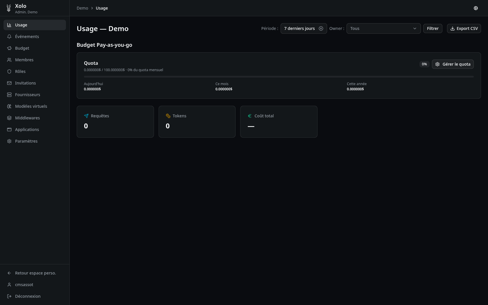

# Bienvenue dans Xolo

Xolo est une passerelle LLM souveraine pour l'entreprise. Elle vous permet de contrôler, surveiller et sécuriser l'accès aux modèles de langage au sein de votre organisation.

---

## Menu de navigation

Le menu latéral de l'organisation propose les sections suivantes :

### Section Usage

| Élément | Description |
|---------|-------------|
| **Utilisation** | Tableau de bord récapitulatif : quota utilisé, nombre de tokens, nombre de requêtes, coût total |
| **[Événements](./evenements/evenement.md)** | Historique des événements (requêtes, erreurs) et gestion des alertes |

### Section Administration

| Tutoriel | Description |
|----------|-------------|
| **[Budget](./budget/budget.md)** | Gestion des budgets (journalier, mensuel, annuel) pour contrôler les dépenses |
| **[Membres](./membre/membre.md)** | Gestion des rôles utilisateurs et des invitations |
| **Rôles** | Création et configuration des rôles et permissions |
| **[Invitations](./invitation/invitation.md)** | Création de liens d'invitation pour intégrer des utilisateurs |
| **[Fournisseurs](./fournisseurs/fournisseurs.md)** | Gestion des fournisseurs LLM et de leurs modèles |
| **[Modèles virtuels](./virtual_model/virtual_model.md)** | Création de modèles personnalisés avec plugins (anonymisation, prompts système) |
| **[Middlewares](./middleware/middleware.md)** | Ajout de traitements dynamiques (contrôle horaire, filtrage, garde-fous) appliqués aux modèles |
| **Applications** | Configuration d'applications pour l'utilisation de la passerelle (exemple : OpenWebUI) |
| **Paramètres** | Gestion de la devise de l'organisation et du partage équitable du budget |

---

## Tutoriels disponibles

| Tutoriel | Niveau | Description |
|----------|--------|-------------|
| [Budget](./budget/budget.md) | Admin | Définir des limites de dépenses |
| [Membres](./membre/membre.md) | Admin | Gérer les utilisateurs et leurs rôles |
| [Invitations](./invitation/invitation.md) | Admin | Créer des liens d'invitation |
| [Fournisseurs](./fournisseurs/fournisseurs.md) | Admin | Connecter des services LLM |
| [Modèles virtuels](./virtual_model/virtual_model.md) | Admin | Créer des modèles personnalisés |
| [Middlewares](./middleware/middleware.md) | Admin | Ajouter des traitements dynamiques aux modèles |
| [Événements](./evenements/evenement.md) | Admin | Consulter les logs et configurer des alertes |

---

## Prochaines étapes

1. **[Invitations](./invitation/invitation.md)** — Invitez vos premiers utilisateurs
2. **[Fournisseurs](./fournisseurs/fournisseurs.md)** — Connectez vos services LLM préférés
3. **[Budget](./budget/budget.md)** — Définissez vos limites de dépenses
