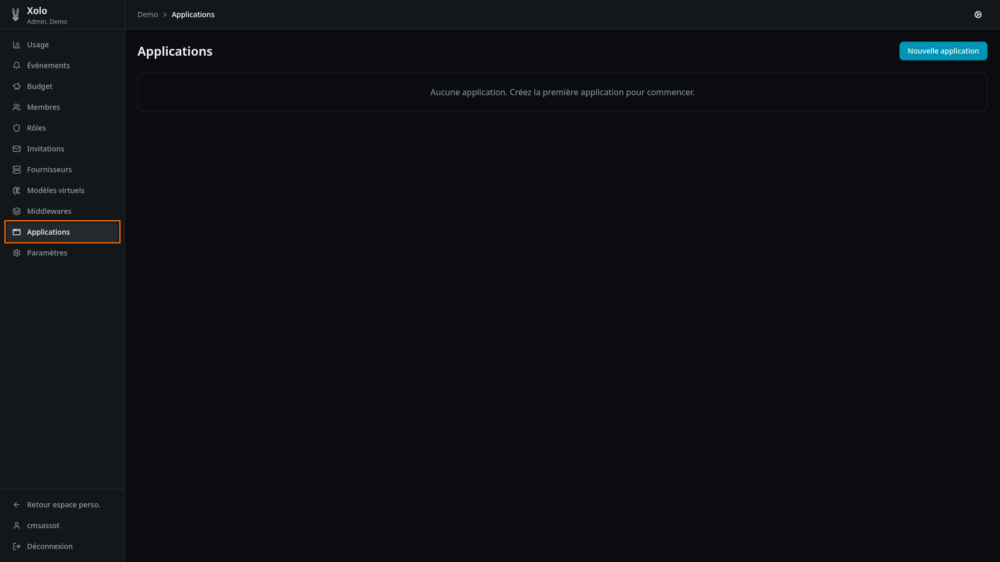
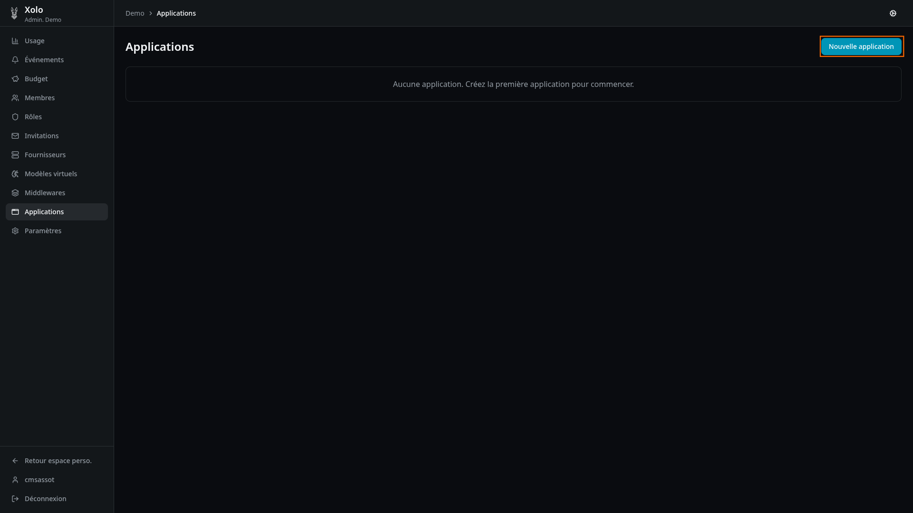
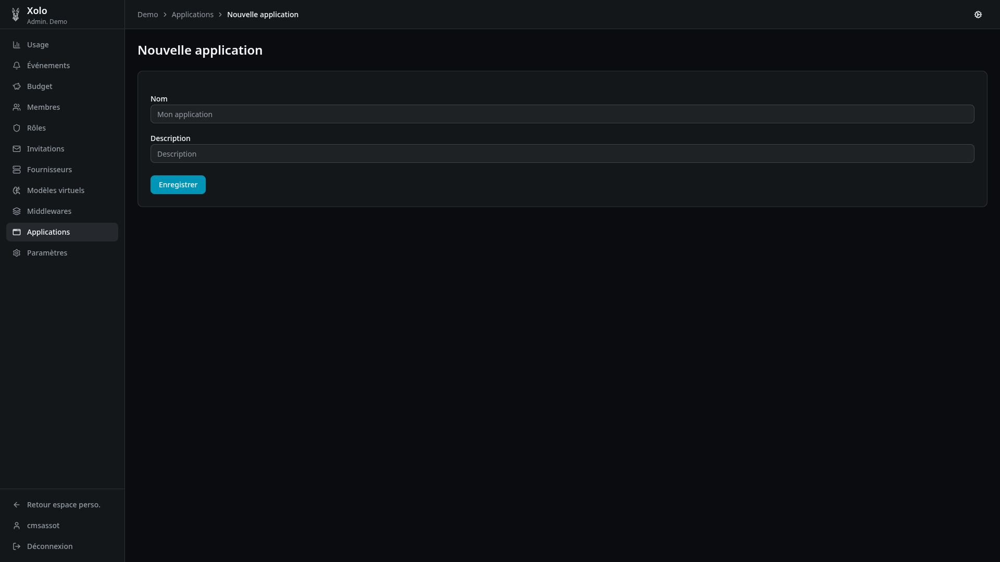
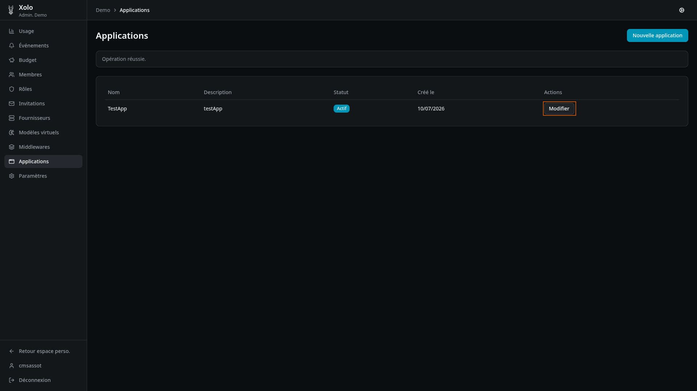
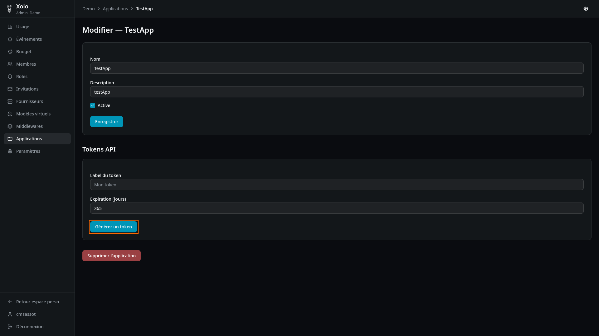
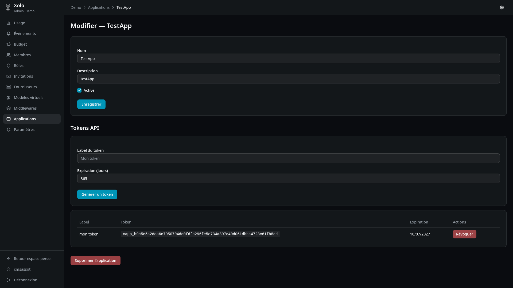
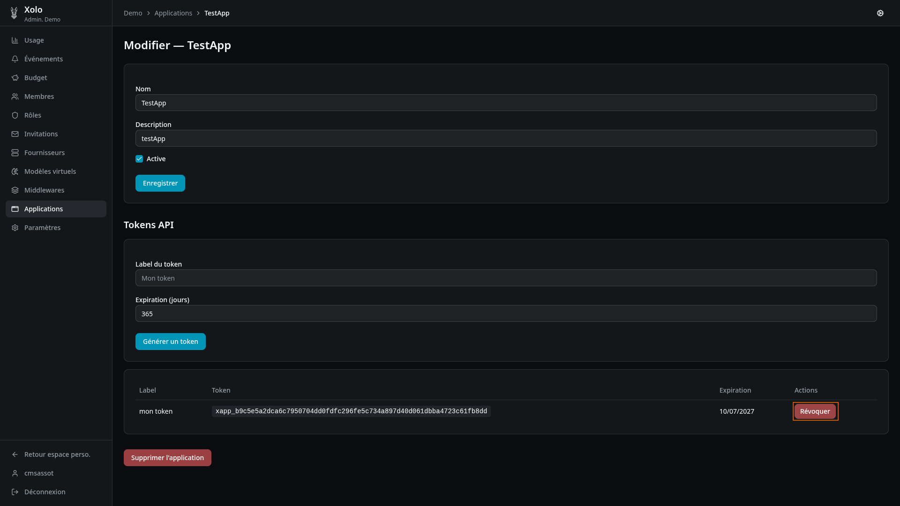

# Applications



## Qu'est-ce qu'une application ?

Une application est une configuration M2M (machine-to-machine) qui permet à des services externes de se connecter à Xolo. Chaque application dispose de ses propres jetons API pour l'authentification.

### Cas d'usage

- **OpenWebUI** : intégration avec l'interface web OpenWebUI
- **Scripts automatisés** : scripts ou services qui interrogent l'API Xolo
- **CI/CD** : intégration dans des pipelines de développement
- **Applications personnalisées** : toute application nécessitant un accès programmatique

## Accéder aux applications

1. Allez dans votre organisation : `/orgs/{slug}/`
2. Cliquez sur **Applications** dans le menu admin
   

> **Note** : Vous devez disposer de la permission `applications:write` pour créer ou modifier des applications.

## Créer une application

1. Cliquez sur **Nouvelle application**
   

2. Remplissez les informations :
   

| Champ           | Description                                       |
| --------------- | ------------------------------------------------- |
| **Nom**         | Nom de l'application (ex: "OpenWebUI Production") |
| **Description** | Description optionnelle                           |

3. Cliquez sur **Enregistrer**.

## Gérer les tokens API

Chaque application peut disposer de plusieurs tokens API.

### Générer un token

1. Ouvrez l'application en modification
   
2. Dans la section **Tokens API**, remplissez :
   - **Label du token** : nom descriptif (ex: "Token production")
   - **Expiration (jours)** : durée de validité (ex: 365 pour 1 an)
3. Cliquez sur **Générer un token**
   
4. Résultat :
   

### Révoquer un token

Pour révoquer un token (le rendre invalide immédiatement) :

- Cliquez sur **Révoquer** sur la ligne du token concerné
  

> **Attention** : Un token révoqué ne peut pas être récupéré. Vous devez en générer un nouveau.

### Expiration des tokens

| Situation                     | Comportement                                         |
| ----------------------------- | ---------------------------------------------------- |
| **Date d'expiration définie** | Le token devient invalide à la date indiquée         |
| **Aucune expiration**         | Le token reste valide jusqu'à sa révocation manuelle |

## Modifier ou désactiver une application

1. Cliquez sur **Modifier** sur la ligne de l'application
2. Modifiez les informations :
   - **Nom** : nouveau nom de l'application
   - **Description** : nouvelle description
   - **Active** : cochez/décochez pour activer ou désactiver

> **Note** : Une application désactivée ne peut plus utiliser ses tokens API.

## Supprimer une application

1. Ouvrez l'application en modification
2. Cliquez sur **Supprimer l'application** en bas du formulaire

> **Attention** : Cette action supprime également tous les tokens associés. Les services utilisant ces tokens perdront immédiatement leur accès.

## Jetons d'application vs jetons utilisateurs

Xolo propose deux types de jetons d'authentification :

| Caractéristique | Jetons d'application                               | Jetons API utilisateurs                 |
| --------------- | -------------------------------------------------- | --------------------------------------- |
| **Création**    | Par un admin, dans les paramètres de l'application | Par chaque utilisateur, dans son profil |
| **Expiration**  | Configurable (ex: 365 jours)                       | Configurable, ou illimitée              |
| **Cas d'usage** | Services M2M (OpenWebUI, scripts)                  | Accès personnel à l'API                 |
| **Identité**    | L'application est identifiée, pas l'utilisateur    | L'utilisateur est identifié             |

### Recommandations

- Utilisez les **jetons d'application** pour les services automatisés (CI/CD, scripts, OpenWebUI)
- Utilisez les **jetons API utilisateurs** pour l'accès personnel à l'API

## Utilisation des tokens API

### Format d'authentification

Utilisez le token dans l'en-tête HTTP `Authorization` :

```bash
Authorization: Bearer <votre_token_api>
```

### Exemple avec curl

```bash
curl -X POST https://xolo.example.com/v1/chat/completions \
  -H "Authorization: Bearer xlo_abc123def456" \
  -H "Content-Type: application/json" \
  -d '{
    "model": "mon-org/gpt-4o",
    "messages": [{"role": "user", "content": "Hello!"}]
  }'
```

## Intégration avec OpenWebUI

OpenWebUI peut être configuré pour utiliser Xolo comme backend LLM.

### Configuration

Dans le fichier de configuration d'OpenWebUI (`openwebui.ini` ou variables d'environnement) :

```ini
# URL de base de Xolo
XOLO_BASE_URL=https://xolo.example.com

# Token API de l'application Xolo
XOLO_API_TOKEN=xlo_votre_token_application

# Modèle par défaut (optionnel)
DEFAULT_MODEL=mon-org/gpt-4o
```

### Variables d'environnement

Vous pouvez également utiliser des variables d'environnement :

```bash
export XOLO_BASE_URL=https://xolo.example.com
export XOLO_API_TOKEN=xlo_votre_token_application
```

### Vérification

Après configuration, les modèles Xolo devraient apparaître dans la liste des modèles disponibles dans OpenWebUI.

## Permissions

| Action                     | Permission requise   |
| -------------------------- | -------------------- |
| Consulter les applications | `applications:read`  |
| Créer, modifier, supprimer | `applications:write` |
