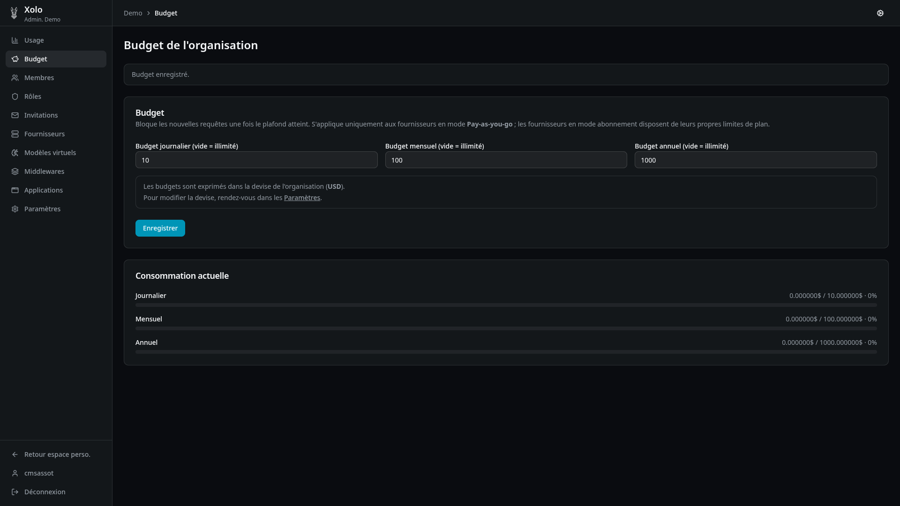
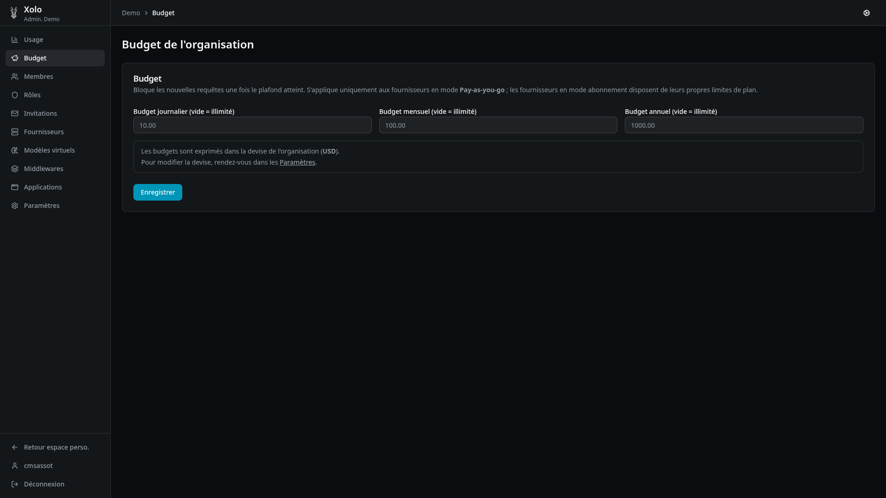

# Budget

## Qu'est-ce que le budget ?

Le budget vous permet de limiter les dépenses de l'organisation ou d'un membre en particulier (voir [la gestion du quotas par utilisateur](../membre/membre.md) ). Une fois le plafond atteint, les nouvelles requêtes API sont bloquées.

Les budgets s'appliquent uniquement aux fournisseurs en mode **Pay-as-you-go**. Les fournisseurs en mode abonnement disposent de leurs propres limites de plan.

## Accéder aux paramètres du budget

1. Rendez-vous dans votre organisation : `/orgs/{slug}/`
2. Cliquez sur **Budget** dans le menu latéral admin

> **Note** : Vous devez disposer de la permission `quota:write` pour modifier les budgets.

## Définir un budget pour l'organisation

1. Sur la page Budget, remplissez un ou plusieurs champs :
   - **Budget journalier** — limite quotidienne
   - **Budget mensuel** — limite mensuelle
   - **Budget annuel** — limite annuelle

2. Laissez un champ vide pour illimité.

3. Cliquez sur **Enregistrer**.

Les montants sont exprimés dans la devise de l'organisation (configurable dans les Paramètres).

## Hiérarchie des budgets

Les budgets fonctionnent à plusieurs niveaux :

| Niveau       | URL                                     | Description                     |
| ------------ | --------------------------------------- | ------------------------------- |
| Organisation | `/orgs/{slug}/admin/quota`              | Budget global de l'organisation |
| Membre       | `/orgs/{slug}/admin/members/{id}/quota` | Budget individuel d'un membre   |

### Calcul du budget effectif

Pour chaque période, Xolo prend le **minimum** des budgets définis :

- Si l'organisation a un budget mensuel de 100€ et un membre de 50€ → le membre est limité à 50€/mois
- Si le membre n'a pas de budget personnel → il utilise le budget de l'organisation

## Partage équitable du budget

Dans les **Paramètres** de l'organisation, vous pouvez activer l'option **Partager le budget équitablement**.

Quand cette option est activée, le budget de l'organisation est divisé automatiquement entre tous ses membres.

**Exemple** : Une organisation avec 100€/mois et 5 membres → chaque membre dispose de 20€/mois.

> Le partage est recalculé automatiquement à chaque modification du nombre de membres.

## Suivre la consommation

La page Budget affiche la consommation actuelle avec des barres de progression :

- Montant dépensé vs budget maximum
- Pourcentage d'utilisation

## Permissions

| Action                | Permission requise |
| --------------------- | ------------------ |
| Consulter les budgets | `quota:read`       |
| Modifier les budgets  | `quota:write`      |

Ces permissions sont attribuables via les **Rôles** de l'organisation.
