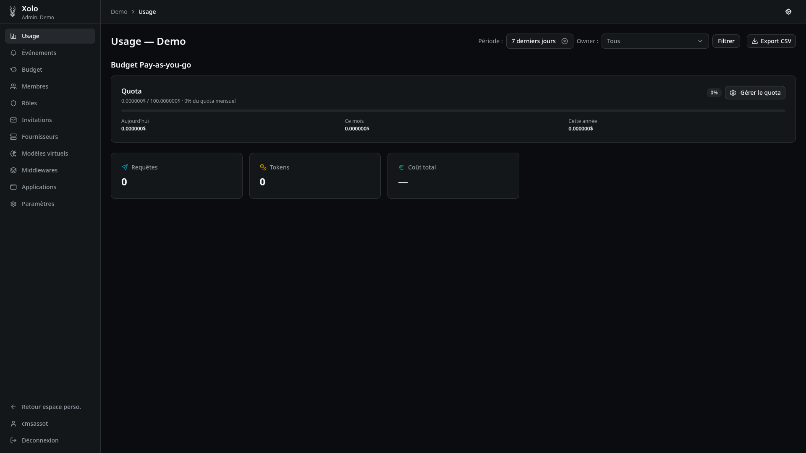

# Tableau de bord



## Qu'est-ce que le tableau de bord ?

Le tableau de bord (Dashboard) est votre interface principale pour visualiser l'utilisation de Xolo. Il affiche un récapitulatif de votre activité et de vos dépenses.

## Accéder au tableau de bord

1. Connectez-vous à Xolo
2. Vous êtes automatiquement redirigé vers le tableau de bord

URL : `/usage`

## Sélecteur de période

Choisissez la période d'affichage :

- **1j** — dernières 24 heures
- **7j** — 7 derniers jours
- **30j** — 30 derniers jours
- **90j** — 90 derniers jours
- **180j** — 180 derniers jours
- **365j** — année complète

### Exporter les données

Cliquez sur **Exporter CSV** pour télécharger les données au format CSV.

## Cartes de résumé

Le tableau de bord affiche des cartes récapitulatives :

| Métrique | Description |
|----------|-------------|
| **Requêtes** | Nombre total d'appels API effectués |
| **Tokens** | Total de tokens utilisés (dont cache) |
| **Coût total** | Dépense totale dans la devise de l'organisation |
| **Énergie** | Consommation estimée en watt-heures (Wh) |
| **CO2** | Émissions de CO2 avec équivalent en km parcourus |

## Graphiques

### Coût par jour

Histogramme affichant l'évolution des coûts journaliers sur la période sélectionnée.

### Coût par modèle

Répartition des coûts sous forme de camembert, par modèle utilisé.

### Coût par provider

Histogramme montrant la répartition des coûts par fournisseur LLM.

## Estimation de la consommation énergétique

Xolo estime la consommation énergétique basée sur le modèle utilisé et le nombre de tokens.

### Facteurs pris en compte

| Facteur | Description |
|---------|-------------|
| **Paramètres du modèle** | Nombre de paramètres actifs (en milliards) |
| **Débit du modèle** | Vitesse de génération (tokens/seconde) |
| **Infrastructure** | Niveau d'infrastructure du provider (Hyperscaler, Major Cloud, Small Provider) |
| **Fenêtre de contexte** | Taille du contexte utilisé |

### Formule simplifiée

L'estimation utilise une formule basée sur :

- **Énergie par token** = f(paramètres, débit, infrastructure)
- **Consommation totale** = Énergie par token × Nombre total de tokens

### Niveaux d'infrastructure

| Niveau | Exemples | Impact |
|--------|----------|--------|
| **Hyperscaler** | Google, Microsoft, OpenAI, Anthropic | Coefficient 1.0 |
| **Major Cloud** | AWS, OVH, CoreWeave, Mistral | Coefficient 0.8 |
| **Small Provider** | Autres fournisseurs | Coefficient 0.6 |

## Estimation des émissions de CO2

Les émissions de CO2 sont calculées à partir de la consommation énergétique estimée.

### Formule

```
Émissions CO2 (kg) = Consommation énergétique (Wh) × Intensité carbone (g/kWh)
```

### Intensité carbone par défaut

| Source | Intensité |
|--------|-----------|
| **Mondiale moyenne** | ~450 g CO2/kWh |

### Équivalent km

Pour faciliter la compréhension, Xolo convertit les émissions en équivalent km parcourus en voiture :

```
Équivalent km = Émissions CO2 (kg) × 4.6  # kg CO2/km pour une voiture moyenne
```

## Tableau des requêtes

Le bas du tableau de bord affiche une liste paginée des requêtes avec :

| Colonne | Description |
|---------|-------------|
| **Date** | Horodatage de la requête |
| **Modèle** | Modèle LLM utilisé |
| **Tokens** | Nombre de tokens consommés |
| **Coût** | Coût de la requête |

## Changer d'organisation

Si vous appartenez à plusieurs organisations, utilisez le menu déroulant dans l'en-tête pour basculer entre elles.

## Tableau de bord de l'organisation

En tant qu'administrateur, vous pouvez également accéder au tableau de bord de l'organisation :

URL : `/orgs/{slug}/usage`

Celui-ci affiche les mêmes informations mais pour l'ensemble de l'organisation.
