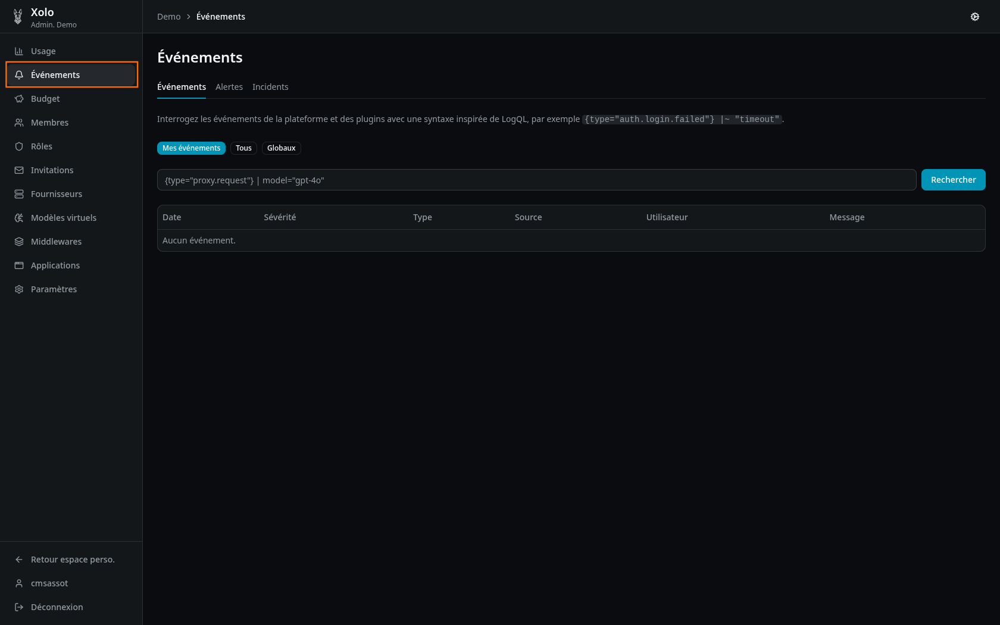
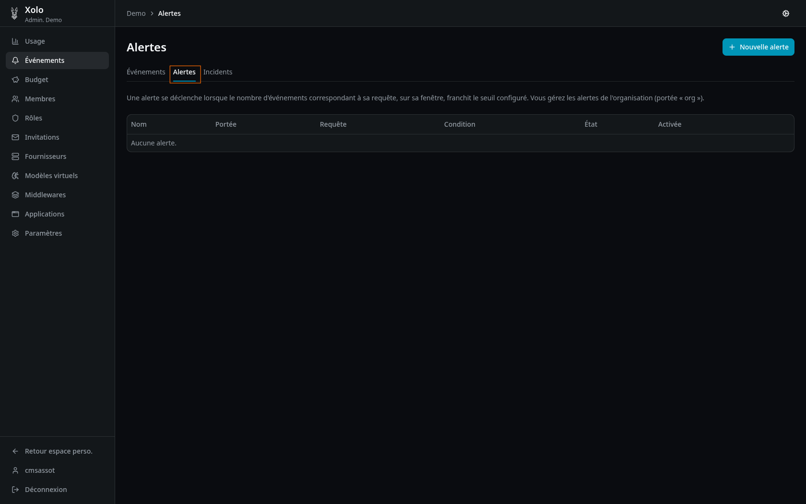
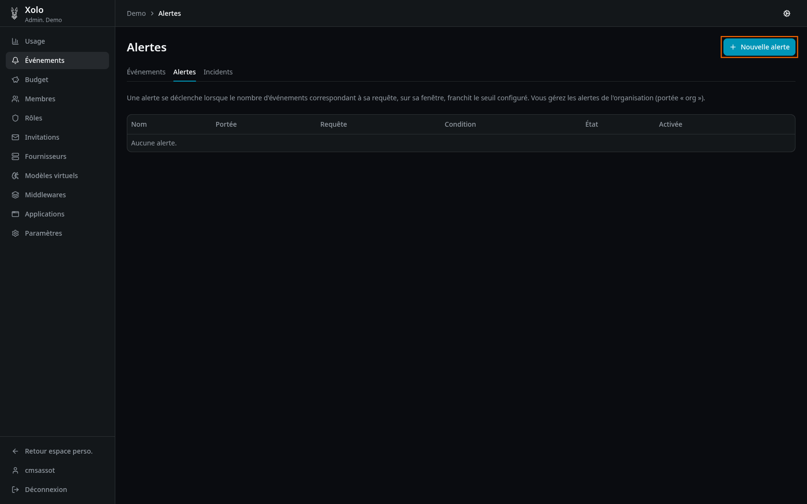
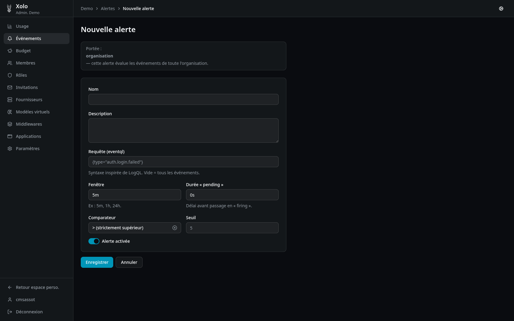
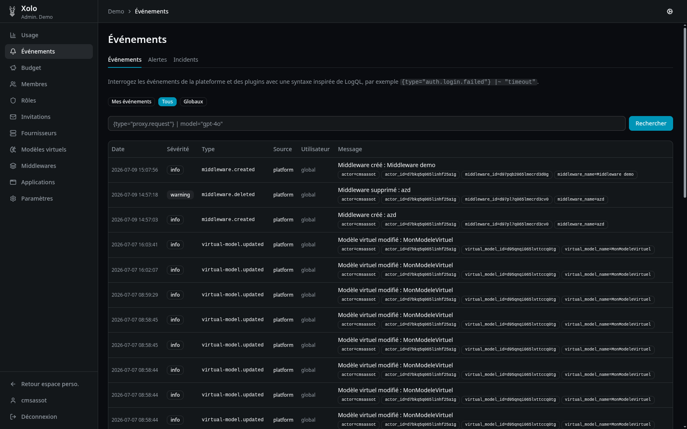

# Événements



## Qu'est-ce qu'un événement ?

Un événement est une entrée de journalisation relative à une action survenue dans la plateforme Xolo. Les événements permettent de tracer l'activité, diagnostiquer des problèmes et déclencher des alertes.

### Types d'événements courants

| Type             | Description                             |
| ---------------- | --------------------------------------- |
| `proxy.request`  | Requête API vers un modèle              |
| `auth.login.*`   | Tentatives de connexion (succès, échec) |
| `quota.exceeded` | Dépassement de budget                   |
| `middleware.*`   | Événements des middlewares              |

### Niveaux de sévérité

| Sévérité    | Description                      |
| ----------- | -------------------------------- |
| **info**    | Information générale             |
| **warning** | Avertissement, attention requise |
| **error**   | Erreur                           |

## Accéder aux événements

1. Allez dans votre organisation : `/orgs/{slug}/`
2. Cliquez sur **Événements** dans le menu

> **Note** : Vous devez disposer de la permission `events:read:all` pour voir tous les événements de l'organisation.

## Parcourir les événements

### Filtres par portée

| Portée             | Description                           |
| ------------------ | ------------------------------------- |
| **Mes événements** | Uniquement vos propres événements     |
| **Tous**           | Tous les événements de l'organisation |
| **Globaux**        | Inclut les événements de plateforme   |

### Syntaxe de requête (LogQL)

Les événements peuvent être filtrés avec une syntaxe inspirée de LogQL :

**Exemples :**

```logql
{type="proxy.request"}
{type="auth.login.failed"}
{type="proxy.request"} | model="gpt-4o"
{type="auth.login.failed"} |~ "timeout"
```

### Colonnes affichées

| Colonne         | Description                            |
| --------------- | -------------------------------------- |
| **Date**        | Horodatage de l'événement              |
| **Sévérité**    | Niveau de criticité                    |
| **Type**        | Type de l'événement                    |
| **Source**      | Origine de l'événement                 |
| **Utilisateur** | Utilisateur concerné (ou "global")     |
| **Message**     | Description de l'événement + attributs |

## Alertes



Les alertes permettent d'être notifié lorsque certains événements se produisent.

### Créer une alerte

1. Cliquez sur **Nouvelle alerte**
   

2. Remplissez les informations :
   

   | Champ                 | Description                                      |
   | --------------------- | ------------------------------------------------ |
   | **Nom**               | Nom de l'alerte                                  |
   | **Description**       | Description optionnelle                          |
   | **Requête**           | Syntaxe LogQL (ex: `{type="auth.login.failed"}`) |
   | **Fenêtre**           | Durée d'évaluation (ex: 5m, 1h, 24h)             |
   | **Durée « pending »** | Délai avant passage en « firing »                |
   | **Comparateur**       | Opérateur de comparaison (> >= < <= ==)          |
   | **Seuil**             | Valeur numérique                                 |
   | **Activé**            | Activer ou désactiver l'alerte                   |

3. Cliquez sur **Enregistrer**.

### États d'une alerte

| État        | Description                                    |
| ----------- | ---------------------------------------------- |
| **ok**      | Fonctionnement normal, seuil non atteint       |
| **pending** | Seuil atteint, en attente du délai « pending » |
| **firing**  | Alerte déclenchée                              |

Exemple :


### Portée des alertes

| Portée    | Description                                  |
| --------- | -------------------------------------------- |
| **org**   | Évalue tous les événements de l'organisation |
| **perso** | Évalue uniquement vos propres événements     |

## Incidents

Les incidents sont l'historique des alertes déclenchées.

### Informations affichées

| Information               | Description                                   |
| ------------------------- | --------------------------------------------- |
| **Nom de l'alerte**       | Alerte qui a déclenché                        |
| **Date de déclenchement** | Quand l'incident a commencé                   |
| **Date de résolution**    | Quand l'incident a été résolu (si applicable) |
| **Pic**                   | Valeur maximale atteinte                      |
| **État**                  | firing ou resolved                            |
| **Événements épinglés**   | Liste des événements contributifs             |

> **Note** : Les événements épinglés sont conservés au-delà de la fenêtre glissante habituelle.

## Permissions

| Action                           | Permission requise         |
| -------------------------------- | -------------------------- |
| Consulter ses propres événements | Aucune (accès automatique) |
| Consulter tous les événements    | `events:read:all`          |
| Gérer les alertes d'organisation | `events:write`             |
| Créer des alertes personnelles   | `events:alerts:own`        |
