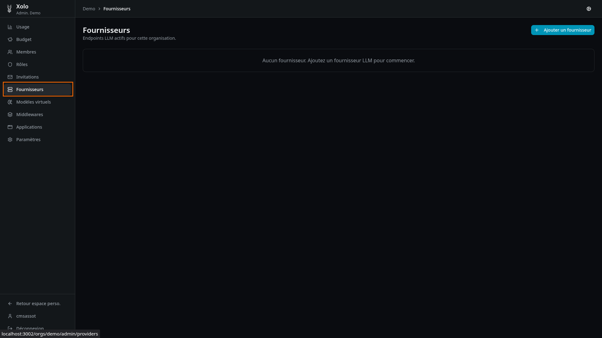
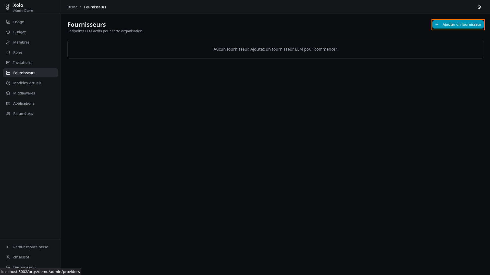
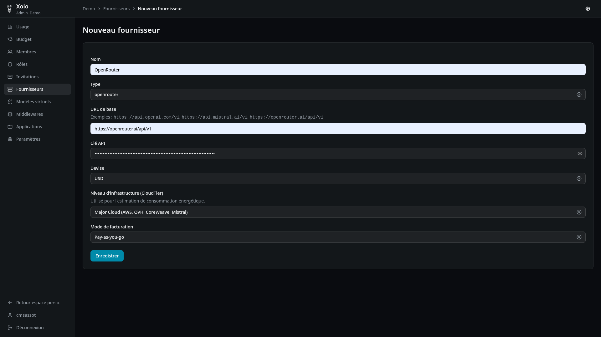
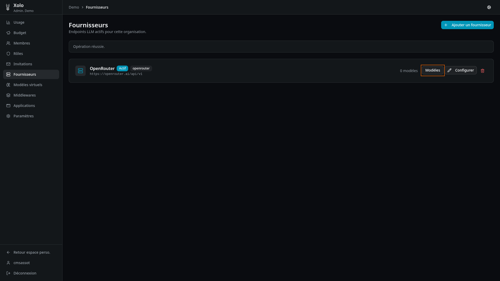
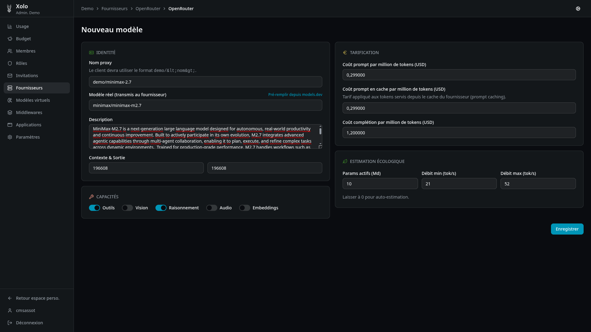
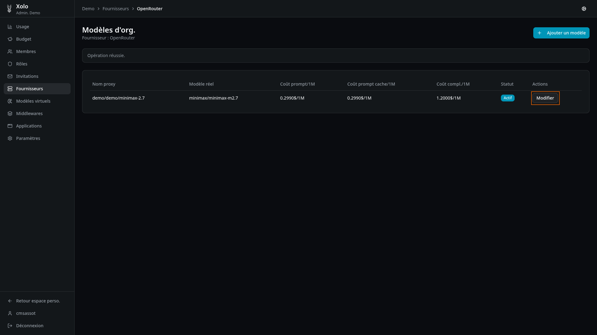
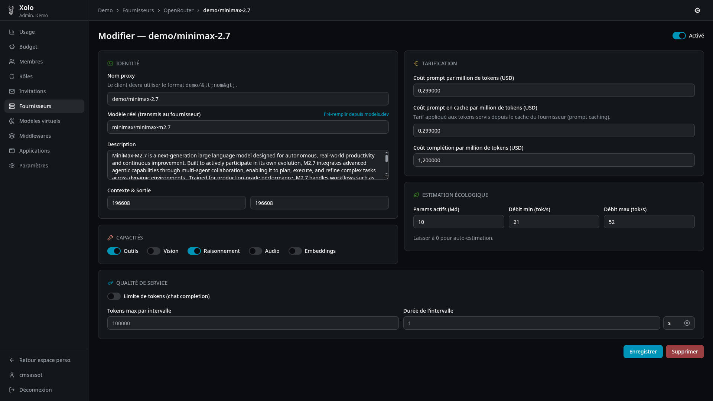

# Fournisseurs

## Qu'est-ce qu'un fournisseur ?

Un fournisseur est une connexion vers un service LLM externe (OpenAI, Mistral, OpenRouter, etc.). Il expose un ou plusieurs modèles que les utilisateurs de l'organisation peuvent consommer.

## Accéder aux fournisseurs

1. Allez dans votre organisation : `/orgs/{slug}/`
2. Cliquez sur **Fournisseurs** dans le menu admin

> **Note** : Vous devez disposer de la permission `providers:write` pour créer ou modifier des fournisseurs.

## Créer un fournisseur

1. Cliquez sur **Ajouter un fournisseur** (bouton en haut à droite)
   

2. Remplissez les informations du fournisseur :
   

   ### Champs du formulaire

   | Champ                       | Description                                                                                           |
   | --------------------------- | ----------------------------------------------------------------------------------------------------- |
   | **Nom**                     | Nom affiché du fournisseur                                                                            |
   | **Type**                    | Type de connexion : `openai`, `mistral`, `openrouter`, `yzma`                                         |
   | **URL de base**             | URL de l'endpoint API (ex: `https://api.openai.com/v1`)                                               |
   | **Clé API**                 | Clé d'authentification auprès du fournisseur                                                          |
   | **Devise**                  | Devise pour la tarification (USD, EUR, etc.)                                                          |
   | **Niveau d'infrastructure** | Type d'hébergement (Hyperscaler, Major Cloud, Small Provider) — utilisé pour l'estimation énergétique |
   | **Mode de facturation**     | **Pay-as-you-go** : facturation à l'usage · **Abonnement** : plan à tokens                            |

3. Cliquez sur **Enregistrer**.

## Tester la connexion

Après avoir créé un fournisseur, utilisez le bouton **Tester la connexion** pour vérifier que Xolo peut communiquer avec le fournisseur.

## Configurer la résilience

Dans les paramètres avancés du fournisseur :

### Retry (nouvelles tentatives)

Permet de retenter automatiquement les requêtes échouées :

- **Nombre de tentatives** : combien de fois réessayer
- **Délai entre tentatives** : temps d'attente entre chaque essai (ms, s, min)

### Rate limit (limitation de débit)

Protection contre les surextensions :

- **Intervalle minimum** : temps minimal entre deux requêtes
- **Capacité de burst** : nombre max de requêtes simultanées autorisées

## Gestion des modèles

Chaque fournisseur peut exposer un ou plusieurs modèles.

### Accéder aux modèles

1. Depuis la liste des fournisseurs, cliquez sur **Modèles**
   

### Créer un modèle

1. Cliquez sur **Ajouter un modèle**
2. Remplissez les informations :
   

#### Champs d'identité

| Champ           | Description                                                          |
| --------------- | -------------------------------------------------------------------- |
| **Nom proxy**   | Nom visible par les utilisateurs (format : `{org-slug}/{nom-proxy}`) |
| **Modèle réel** | Nom exact du modèle chez le fournisseur                              |
| **Description** | Description optionnelle                                              |
| **Contexte**    | Taille de la fenêtre de contexte en tokens                           |
| **Sortie**      | Taille max de la réponse en tokens                                   |

#### Champs de capacités

| Capacité         | Description                                 |
| ---------------- | ------------------------------------------- |
| **Outils**       | Le modèle peut utiliser des tools/functions |
| **Vision**       | Le modèle peut analyser des images          |
| **Raisonnement** | Le modèle utilise du chain-of-thought       |
| **Audio**        | Le modèle supporte l'audio                  |
| **Embeddings**   | Le modèle peut produire des embeddings      |

#### Champs de tarification

| Champ                    | Description                                 |
| ------------------------ | ------------------------------------------- |
| **Coût prompt/1M**       | Prix par million de tokens en entrée        |
| **Coût prompt cache/1M** | Prix pour les tokens servis depuis le cache |
| **Coût complétion/1M**   | Prix par million de tokens en sortie        |

#### Champs d'estimation écologique

| Champ                  | Description                                 |
| ---------------------- | ------------------------------------------- |
| **Params actifs (Md)** | Nombre de paramètres du modèle en milliards |
| **Débit min/max**      | Vitesse de génération estimée (tokens/s)    |

> **Astuce** : Cliquez sur **Pré-remplir depuis models.dev** pour importer automatiquement les informations d'un modèle depuis le catalogue.

### Activer ou désactiver un modèle

Lors de l'édition d'un modèle, utilisez le commutateur **Activé** pour rendre le modèle accessible ou indisponible sans le supprimer.

### Supprimer un modèle

1. Ouvrez le modèle en modification
   
2. Cliquez sur **Supprimer**
   

## Supprimer un fournisseur

1. Allez dans la configuration du fournisseur
2. Cliquez sur **Supprimer le fournisseur**

> **Attention** : Cette action supprime également tous les modèles associés.

## Permissions

| Action                            | Permission requise |
| --------------------------------- | ------------------ |
| Consulter les fournisseurs        | `providers:read`   |
| Gérer les fournisseurs et modèles | `providers:write`  |
