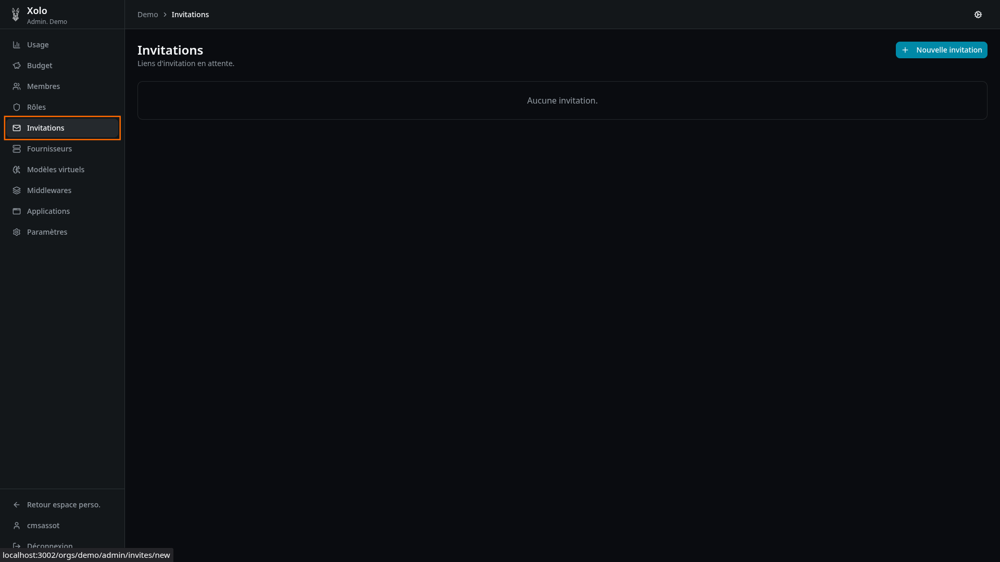
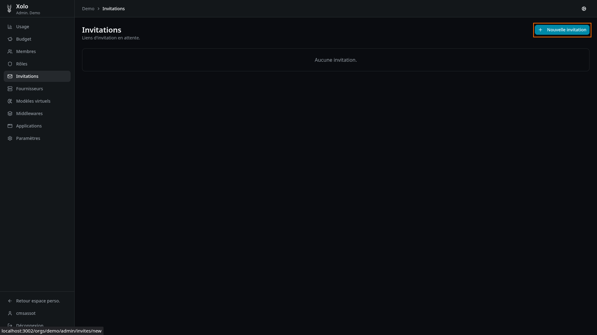
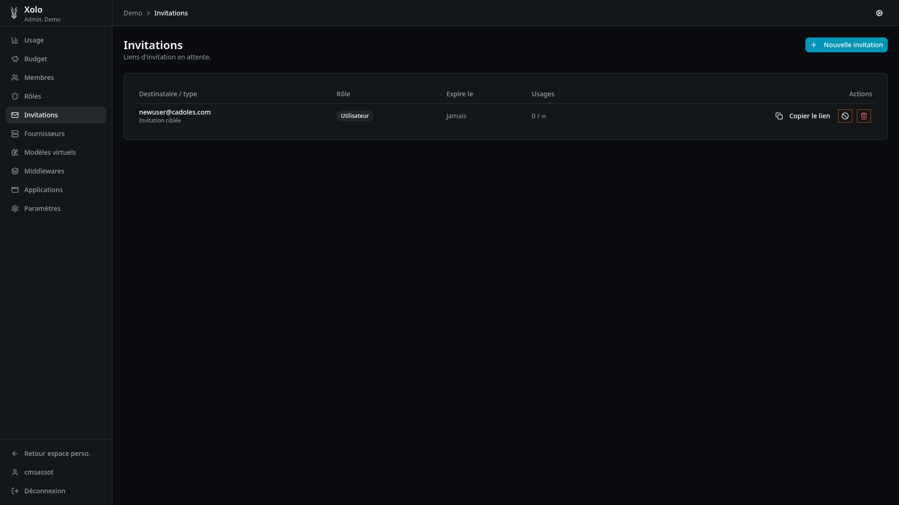

# Invitation des utilisateurs

## Envoyer une invitation

- Cliquer sur `Nouvelle invitation` (bouton en haut à droite)
  
- Saisir les informations
  
  il est possible de rendre l'utilisation unique ou mettre une date d'expiration
- Cliquer sur `Créer le lien`
- Vous êtes redirigé sur la liste des invitations
  
- Un lien est affiché, il peut être envoyé à l'utilisateur. Ce lien lui permettera de rejoindre l'organisation.

## Gestion des invitations

Deux boutons sont disponible pour chaque invitation:

- Révoquer l'invitation
- Supprimer l'invitation
  
