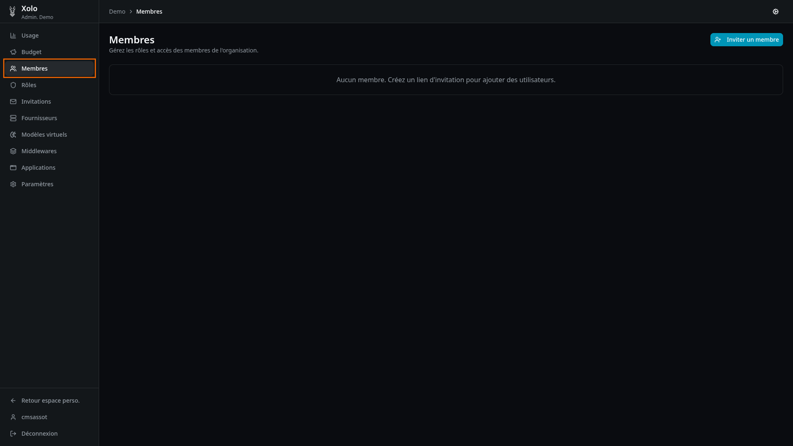
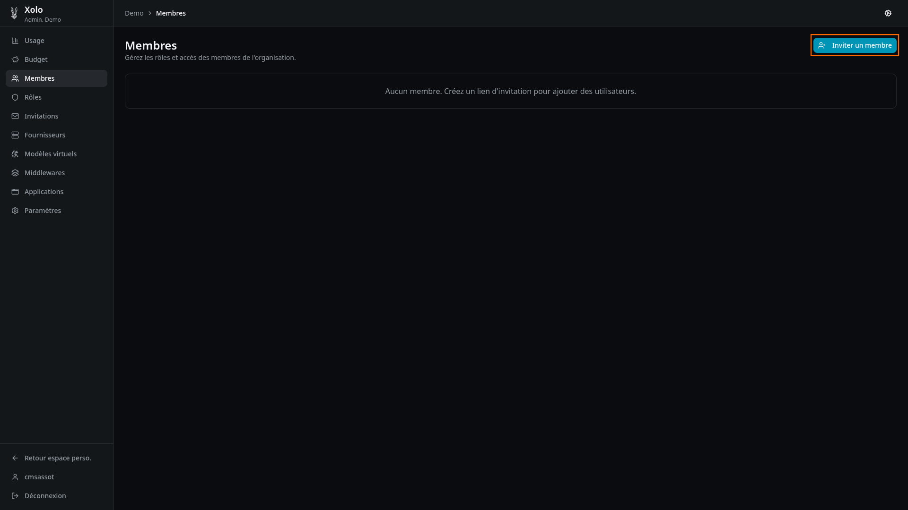
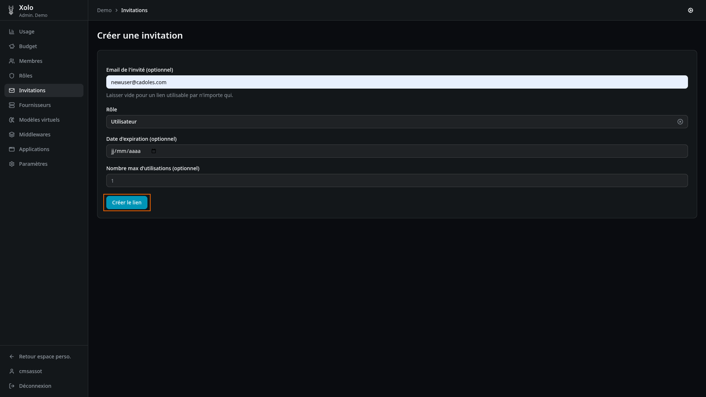
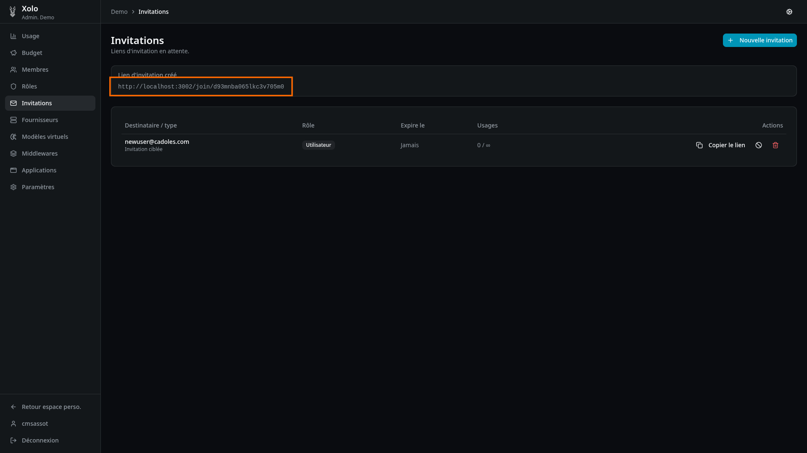
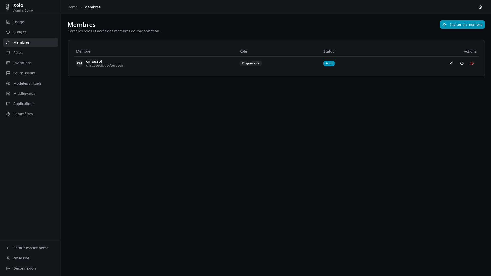
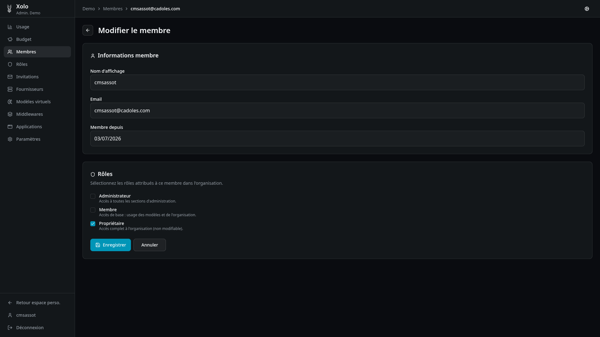

# Membre

## Envoyer une invitation

- Cliquer sur `Ajouter un membre` (bouton en haut à droite)
  
- Saisir les informations
  
  il est possible de rendre l'utilisation unique ou mettre une date d'expiration
- Cliquer sur `Créer le lien`
- Vous êtes redirigé sur la liste des invitations
  
- Un lien est affiché, il peut être envoyé à l'utilisateur. Ce lien lui permettera de rejoindre l'organisation.

## Gestion des membre

3 boutons sont disponibles sur chaque membre:

- `Edition`
- `Quota`
- `Retirer`

### Edition

Les roles (paramétrable depuis l'onglet `Rôles` TODO VOIR TUTO) peuvent être gérés :

