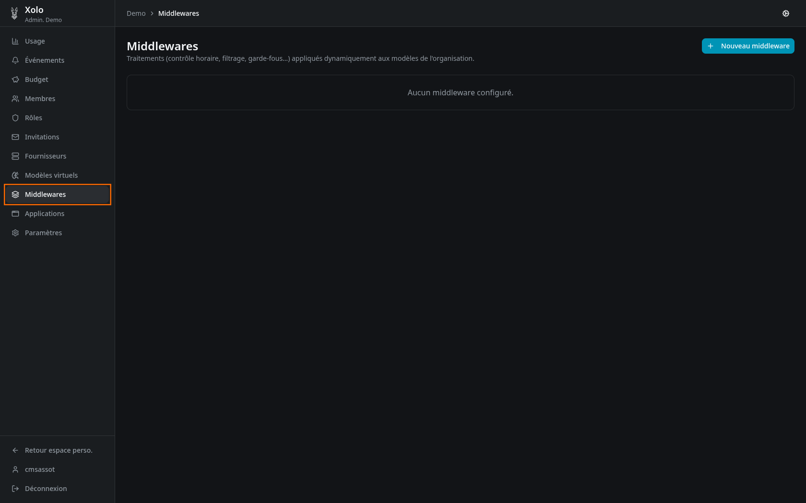
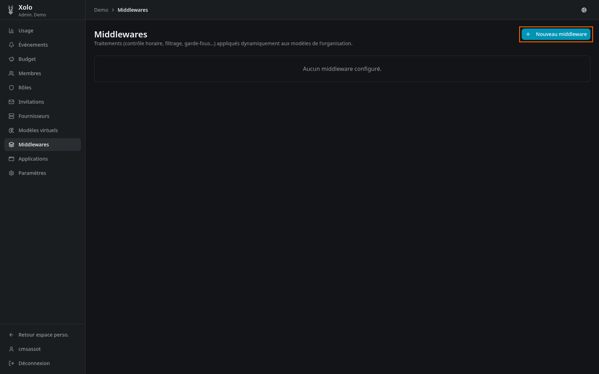
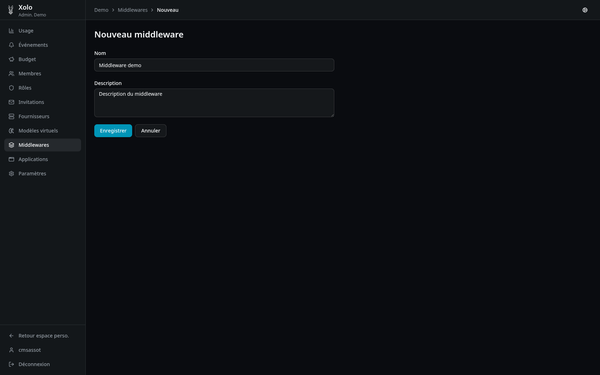
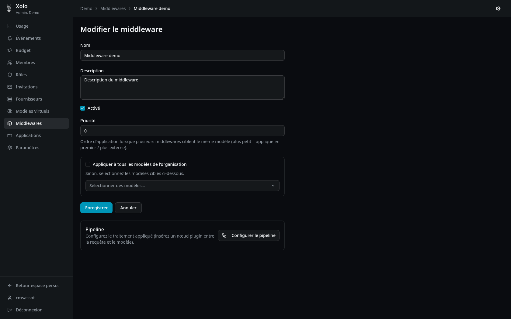

# Middleware

## Qu'est-ce qu'un middleware ?

Un middleware est un traitement transparent appliqué aux requêtes avant qu'elles n'atteignent le modèle LLM. Il permet d'ajouter des contrôles de sécurité, de filtrage ou de transformation sans modifier le code de l'application cliente.

### Cas d'usage courants

- **Contrôle horaire** : limiter l'accès à certaines heures
- **Filtrage de contenu** : vérifier ou modifier les prompts
- **Garde-fous** : ajouter des règles de sécurité
- **Journalisation** : tracer les requêtes

## Accéder aux middlewares

1. Allez dans votre organisation : `/orgs/{slug}/`
2. Cliquez sur **Middlewares** dans le menu admin

> **Note** : Vous devez disposer de la permission `middlewares:write` pour créer ou modifier des middlewares.

## Créer un middleware

1. Cliquez sur **Nouveau middleware** (bouton en haut à droite)
   

2. Remplissez les informations :
   

   ### Champs du formulaire

   | Champ           | Description                                |
   | --------------- | ------------------------------------------ |
   | **Nom**         | Nom du middleware (ex: "contrôle horaire") |
   | **Description** | Description optionnelle                    |

3. Cliquez sur **Enregistrer**.

## Configurer le middleware

Après création, vous pouvez configurer le middleware :

### Champs de configuration

| Champ                            | Description                                                             |
| -------------------------------- | ----------------------------------------------------------------------- |
| **Activé**                       | Active ou désactive le middleware                                       |
| **Priorité**                     | Ordre d'application (plus petit = appliqué en premier)                  |
| **Appliquer à tous les modèles** | Si coché, le middleware s'applique à tous les modèles de l'organisation |
| **Modèles ciblés**               | Si non coché, sélectionnez les modèles spécifiques concernés            |

### Pipeline

Le pipeline définit le traitement appliqué. Pour le configurer, cliquez sur **Configurer le pipeline** après avoir créé le middleware.

## Gérer les middlewares

### Liste des middlewares

La page principale affiche tous les middlewares avec :

| Information     | Description                                    |
| --------------- | ---------------------------------------------- |
| **Nom**         | Nom du middleware                              |
| **Description** | Description                                    |
| **Statut**      | Activé ou Désactivé                            |
| **Portée**      | "Tous les modèles" ou nombre de modèles ciblés |
| **Priorité**    | Ordre d'exécution                              |

### Actions disponibles

| Action        | Description                           |
| ------------- | ------------------------------------- |
| **Pipeline**  | Configurer le pipeline de traitement  |
| **Modifier**  | Modifier les paramètres du middleware |
| **Supprimer** | Supprimer le middleware               |

## Ordre d'exécution

Les middlewares sont appliqués dans l'ordre de priorité croissant (du plus petit au plus grand). Cela permet de chaîner plusieurs traitements.

**Exemple** :

1. Logging (priorité 1)
2. Contrôle horaire (priorité 10)
3. Filtrage de contenu (priorité 20)

## Permissions

| Action                     | Permission requise  |
| -------------------------- | ------------------- |
| Consulter les middlewares  | `middlewares:read`  |
| Créer, modifier, supprimer | `middlewares:write` |
