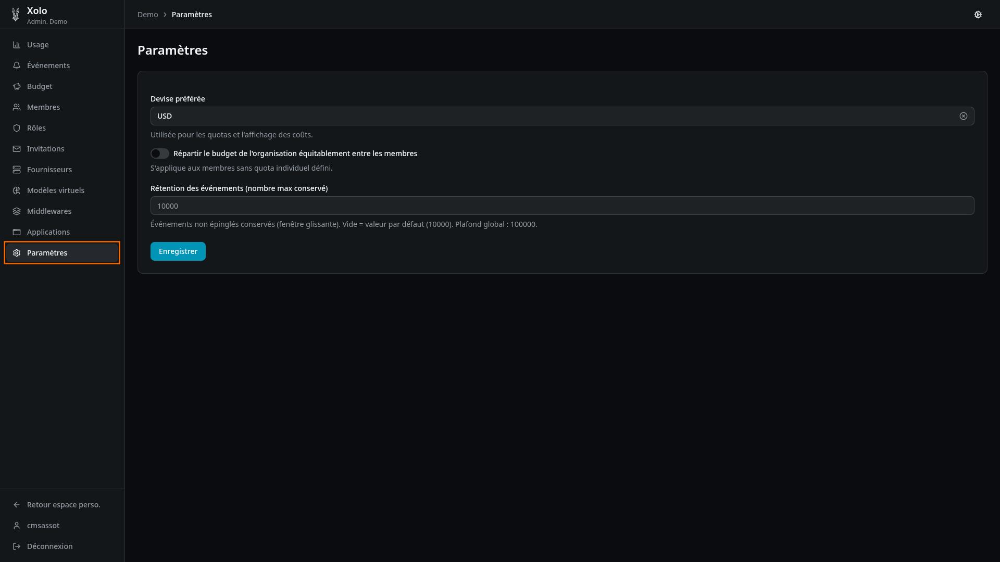

# Paramètres



## Qu'est-ce que les paramètres ?

Les paramètres permettent de configurer les réglages généraux de l'organisation : la devise utilisée pour les budgets et l'affichage des coûts, la répartition équitable du budget, et la rétention des événements.

## Accéder aux paramètres

1. Allez dans votre organisation : `/orgs/{slug}/`
2. Cliquez sur **Paramètres** dans le menu admin

> **Note** : Vous devez disposer de la permission `settings:write` pour modifier les paramètres.

## Devise préférée

La devise est utilisée pour les budgets et l'affichage des coûts dans l'interface.

### Devises disponibles

USD, EUR, GBP, JPY, CHF, CAD, AUD

### Impact sur les budgets existants

> **Attention** : La modification de la devise n'affecte pas les budgets existants. Elle s'applique uniquement :
> - Aux nouveaux budgets créés après la modification
> - À l'affichage des coûts dans l'interface
>
> Les budgets existants gardent leur valeur numérique ; seule l'interprétation change (ex : 100 devient 100€ au lieu de 100$).

Pour éviter toute confusion, il est recommandé de définir la devise dès la création de l'organisation.

## Répartir le budget équitablement

Cette option permet de diviser automatiquement le budget de l'organisation entre tous ses membres.

### Fonctionnement

1. Activez l'option **Répartir le budget de l'organisation équitablement entre les membres**
2. Le budget de l'organisation est divisé par le nombre de membres
3. Chaque membre dispose ainsi d'une partie du budget global

### Exemple

| Organisation | Membres | Budget mensuel | Budget par membre |
|--------------|---------|----------------|-------------------|
| Acme Corp | 5 | 500€ | 100€ |

### Priorité des budgets

> **Note** : Cette option s'applique uniquement aux membres sans quota individuel défini. Xolo utilise la règle suivante :
> 1. Si un membre a un quota personnel → son quota est utilisé
> 2. Si le membre n'a pas de quota personnel → le quota partagé (org ÷ nombre de membres) est utilisé

### Aperçu

La page affiche un aperçu du budget partagé avec :
- Nombre de membres actuels
- Budget journalier partagé (si un budget journalier est défini au niveau organisation)
- Budget mensuel partagé (si un budget mensuel est défini au niveau organisation)
- Budget annuel partagé (si un budget annuel est défini au niveau organisation)

> Le partage est recalculé automatiquement à chaque modification du nombre de membres.

## Rétention des événements

La rétention définit le nombre maximum d'événements conservés dans la fenêtre glissante.

### Champs

| Champ | Description |
|-------|-------------|
| **Rétention des événements** | Nombre max d'événements conservés (fenêtre glissante) |

### Comportement détaillé

| Situation | Comportement |
|-----------|-------------|
| **Champ vide** | Utilise la valeur par défaut de la plateforme |
| **Valeur positive** | Conserve les N événements les plus récents |
| **Événements épinglés** | Conservés indéfiniment, hors de la fenêtre glissante |
| **Plafond global** | Limite maximale imposée par la plateforme (ne peut pas être dépassée) |

### Fenêtre glissante

La fenêtre glissante est un mécanisme qui conserve automatiquement les événements les plus récents tout en supprimant les plus anciens :

```
┌─────────────────────────────────────────────────┐
│ Fenêtre glissante (ex: 1000 événements)        │
├─────────────────────────────────────────────────┤
│ [événement 1] [événement 2] ... [événement 1000] │
└─────────────────────────────────────────────────┘
     ↑ anciens              ↑ récents
            ↑ supprimés automatiquement
```

**Exemple** : Si vous avez 1500 événements et une rétention de 1000, les 500 événements les plus anciens sont automatiquement supprimés.

### Épingler des événements

Certains événements peuvent être "épinglés" (par exemple, ceux liés à une alerte déclenchée). Ces événements épinglés sont conservés indéfiniment et ne sont pas affectés par la fenêtre glissante.

## Permissions

| Action | Permission requise |
|--------|-------------------|
| Consulter les paramètres | `settings:read` |
| Modifier les paramètres | `settings:write` |
