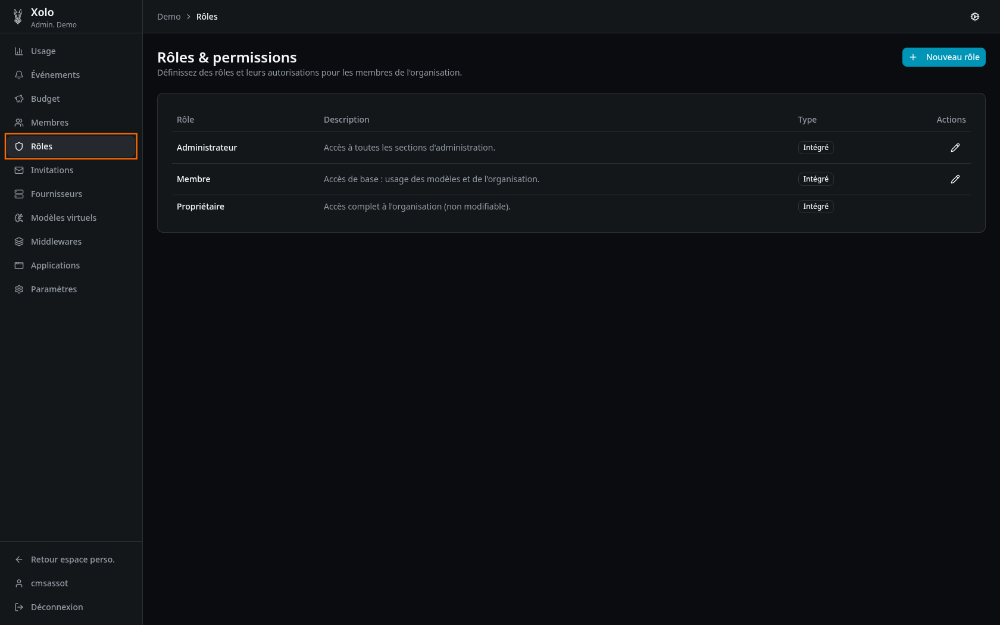
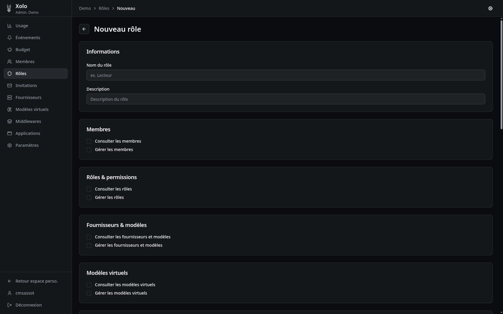

# Rôles & Permissions

## Qu'est-ce qu'un rôle ?

Un rôle est un ensemble de permissions qui définit ce qu'un membre peut faire dans l'organisation. Chaque membre peut se voir attribuer plusieurs rôles.

### Rôles intégrés

| Rôle       | Description                                                             |
| ---------- | ----------------------------------------------------------------------- |
| **Owner**  | Contrôle total de l'organisation (ne peut pas être modifié ni supprimé) |
| **Admin**  | Gestion complète de l'organisation sauf suppression                     |
| **Member** | Accès de base à l'organisation                                          |

### Rôles personnalisés

Vous pouvez créer vos propres rôles avec des combinaisons de permissions adaptées à vos besoins.

## Accéder aux rôles

1. Allez dans votre organisation : `/orgs/{slug}/`
2. Cliquez sur **Rôles** dans le menu admin

> **Note** : Vous devez disposer de la permission `roles:write` pour créer ou modifier des rôles.

## Créer un rôle

1. Cliquez sur **Nouveau rôle** (bouton en haut à droite)

2. Remplissez les informations :
   

### Champs du formulaire

| Champ           | Description                                        |
| --------------- | -------------------------------------------------- |
| **Nom du rôle** | Nom affiché du rôle (ex: "Lecteur", "Développeur") |
| **Description** | Description optionnelle du rôle                    |

3. Cochez les permissions souhaitées dans les différentes catégories

4. Cliquez sur **Enregistrer**.

## Permissions disponibles

Les permissions sont organisées par catégorie :

### Membres

| Permission            | Description                            |
| --------------------- | -------------------------------------- |
| Consulter les membres | Voir la liste des membres              |
| Gérer les membres     | Inviter, modifier, retirer des membres |

### Rôles & permissions

| Permission          | Description                          |
| ------------------- | ------------------------------------ |
| Consulter les rôles | Voir les rôles existants             |
| Gérer les rôles     | Créer, modifier, supprimer des rôles |

### Fournisseurs & modèles

| Permission                            | Description                                        |
| ------------------------------------- | -------------------------------------------------- |
| Consulter les fournisseurs et modèles | Voir les configurations LLM                        |
| Gérer les fournisseurs et modèles     | Créer, modifier, supprimer fournisseurs et modèles |

### Modèles virtuels

| Permission                     | Description                                     |
| ------------------------------ | ----------------------------------------------- |
| Consulter les modèles virtuels | Voir les modèles personnalisés                  |
| Gérer les modèles virtuels     | Créer, modifier, supprimer des modèles virtuels |

### Middlewares

| Permission                | Description                                |
| ------------------------- | ------------------------------------------ |
| Consulter les middlewares | Voir les middlewares configurés            |
| Gérer les middlewares     | Créer, modifier, supprimer des middlewares |

### Budget

| Permission          | Description              |
| ------------------- | ------------------------ |
| Consulter le budget | Voir les budgets définis |
| Gérer le budget     | Modifier les budgets     |

### Invitations

| Permission                | Description                                |
| ------------------------- | ------------------------------------------ |
| Consulter les invitations | Voir les invitations en attente            |
| Gérer les invitations     | Créer, révoquer, supprimer des invitations |

### Applications

| Permission                 | Description                                 |
| -------------------------- | ------------------------------------------- |
| Consulter les applications | Voir les applications configurées           |
| Gérer les applications     | Créer, modifier, supprimer des applications |

### Paramètres

| Permission               | Description                           |
| ------------------------ | ------------------------------------- |
| Consulter les paramètres | Voir les paramètres de l'organisation |
| Gérer les paramètres     | Modifier les paramètres               |

### Usage

| Permission        | Description                         |
| ----------------- | ----------------------------------- |
| Consulter l'usage | Voir les statistiques d'utilisation |

### Événements & alertes

| Permission                          | Description                                  |
| ----------------------------------- | -------------------------------------------- |
| Consulter les événements globaux    | Voir tous les événements de l'organisation   |
| Gérer les alertes de l'organisation | Créer, modifier, supprimer des alertes org   |
| Créer des alertes personnelles      | Créer des alertes sur ses propres événements |

### Usage des modèles

| Permission                                  | Description                       |
| ------------------------------------------- | --------------------------------- |
| Utiliser tous les modèles de l'organisation | Accès à tous les modèles LLM      |
| Utiliser tous les modèles virtuels          | Accès à tous les modèles virtuels |

### Personnel

| Permission                            | Description                       |
| ------------------------------------- | --------------------------------- |
| Créer des modèles virtuels personnels | Créer des modèles virtuels privés |

## Accès restreint aux modèles

En plus des permissions globales, vous pouvez autoriser explicitement l'accès à des modèles spécifiques :

1. Dans le formulaire du rôle, descendez jusqu'à la section **Modèles autorisés (accès restreint)**
2. Cochez les modèles auxquels ce rôle doit avoir accès

> **Note** : Cette fonctionnalité permet de limiter l'accès à certains modèles même sans la permission globale `model:use:org`.

## Modifier un rôle

1. Cliquez sur l'icône **Modifier** (crayon) sur la ligne du rôle

> **Attention** : Les rôles intégrés (Owner, Admin, Member) ne peuvent pas être supprimés, et leur nom/description ne peuvent pas être modifiés.

## Supprimer un rôle

1. Cliquez sur l'icône **Supprimer** (poubelle) sur la ligne du rôle personnalisé

> **Attention** : La suppression d'un rôle retire immédiatement les permissions associées à tous les membres qui le détenaient.

## Permissions

| Action                     | Permission requise |
| -------------------------- | ------------------ |
| Consulter les rôles        | `roles:read`       |
| Créer, modifier, supprimer | `roles:write`      |

## Règle implicite

Lorsqu'une permission d'écriture (`*:write`) est attribuée, la permission de lecture correspondante (`*:read`) est automatiquement accordée.
