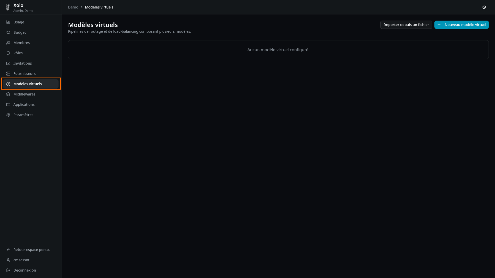
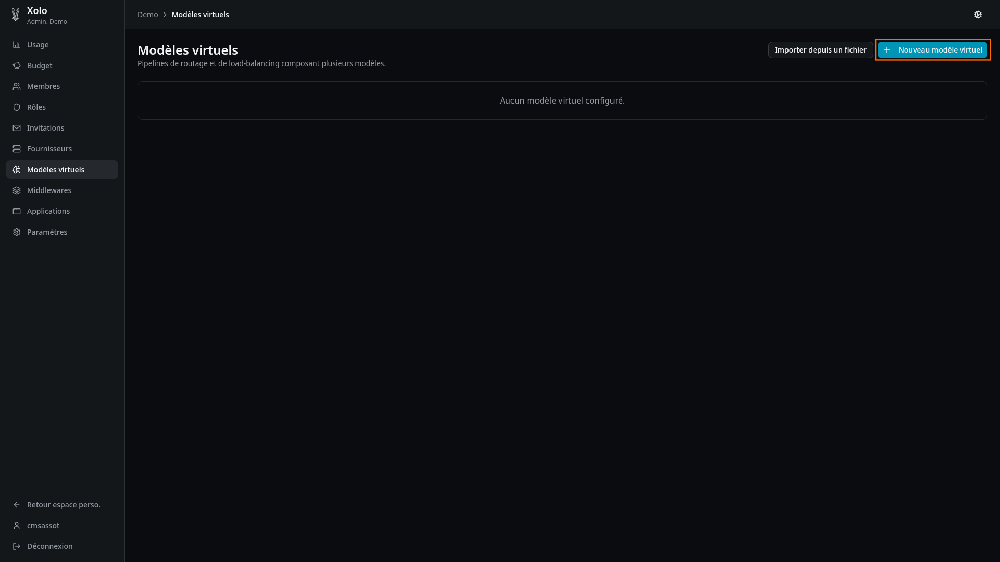
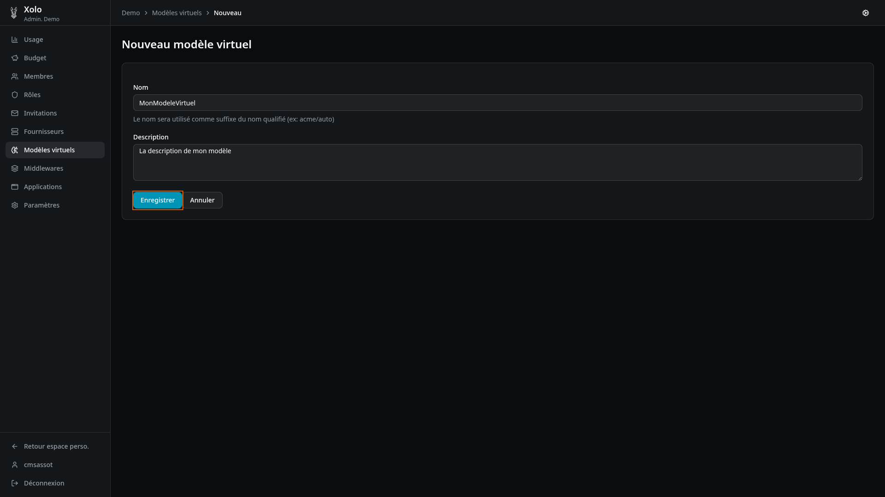
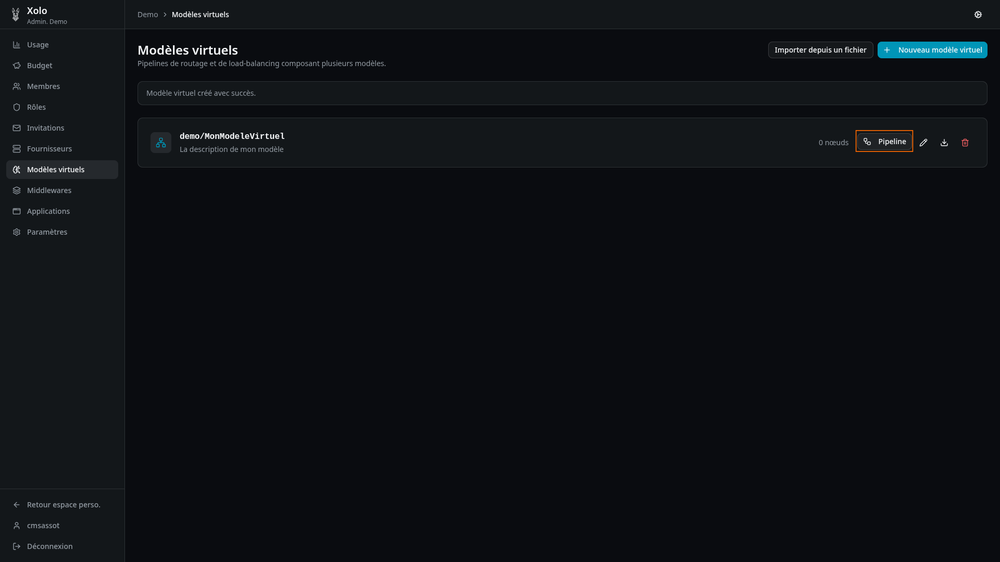
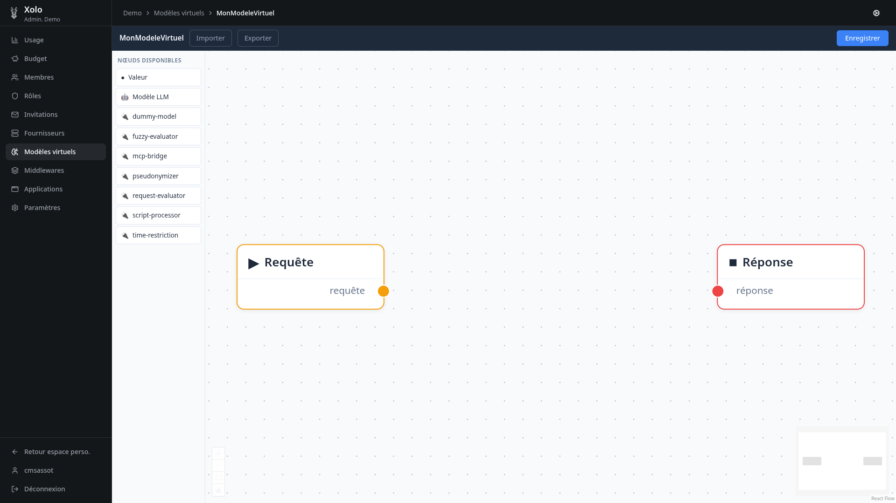
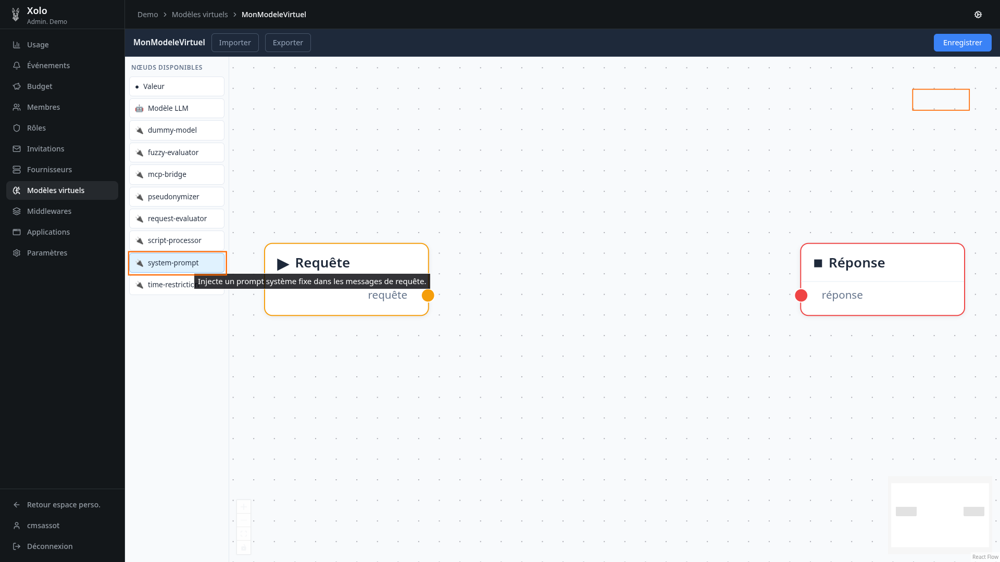
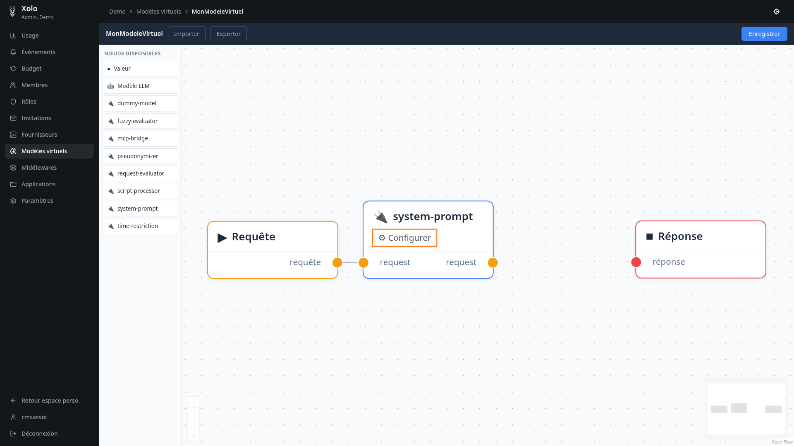
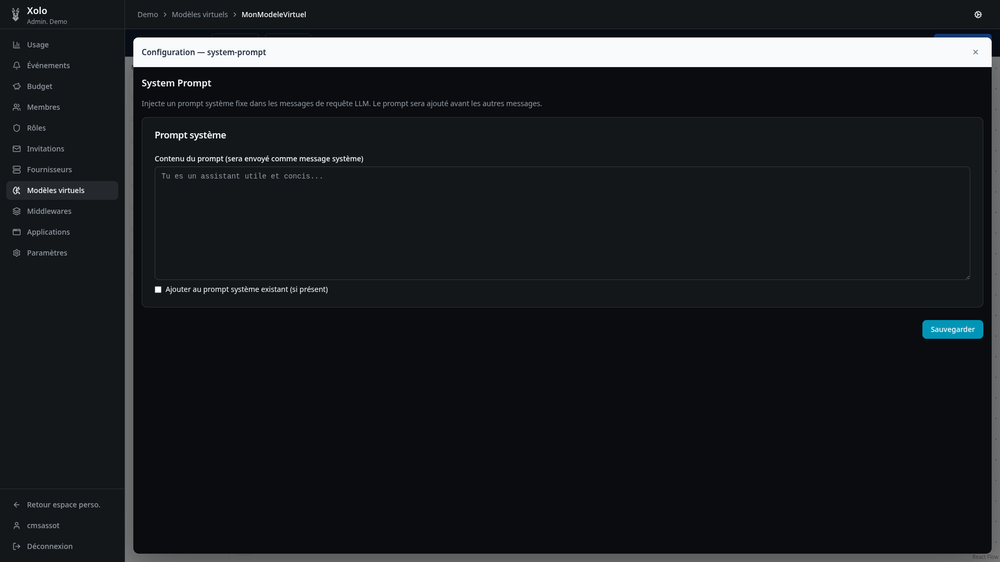
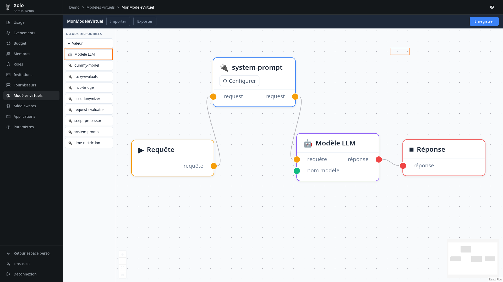
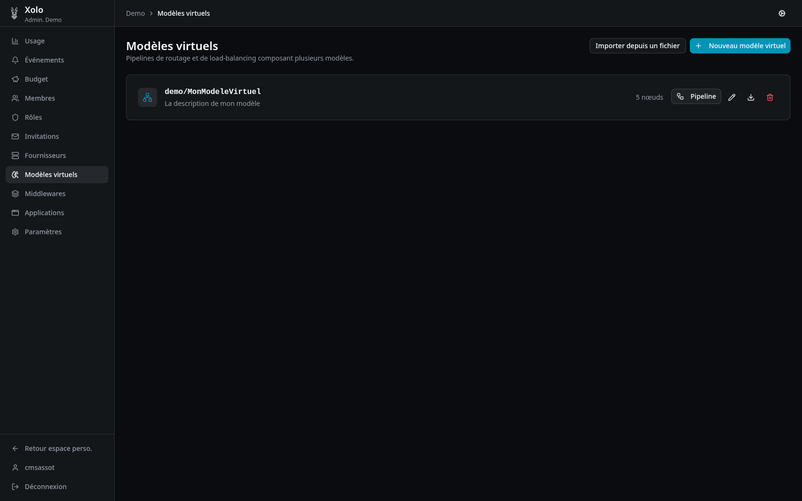

# Modèle virtuel

## Qu'est-ce qu'un modèle virtuel ?

Un modèle virtuel est un modèle personnalisé qui applique des traitements automatiques aux requêtes. Par exemple, il peut anonymiser les prompts, ajouter un prompt système, etc.

Une fois créé, il fonctionne comme un modèle classique. L'utilisateur ne perçoit pas les traitements appliqués en arrière-plan par les plugins.

## Création d'un modèle virtuel

Pour créer un modèle virtuel :

1. Cliquez sur `Nouveau modèle virtuel`
   
2. Renseignez les informations demandées
3. Cliquez sur `Enregistrer`
   
4. Votre modèle est créé et prêt à être configuré
   

## Présentation de l'éditeur de pipeline

Cet éditeur permet de configurer des traitements qui seront appliqués automatiquement aux requêtes et aux réponses du modèle.
TODO UPDATE LISTE DES PLUGINS + DESCRIPTION DES PLUGINS

Xolo est livré avec plusieurs plugins intégrés :

| Plugin              | Type          | Description                                                                                 |
| ------------------- | ------------- | ------------------------------------------------------------------------------------------- |
| `fuzzy-evaluator`   | PRE_REQUEST   | Évaluation par logique floue des valeurs numériques                                         |
| `mcp-bridge`        | -             | Pont vers les serveurs MCP                                                                  |
| `pseudonymiser`     | PRE_REQUEST   | Anonymisation des données                                                                   |
| `request-evaluator` | PRE_REQUEST   | Évalue la complexité, la vision, le raisonnement et la consommation d'énergie d'une requête |
| `script-processor`  | PRE_REQUEST   | Exécute un script Tengo avec des ports d'entrée/sortie personnalisés                        |
| `time-restriction`  | PRE_REQUEST   | Restreint l'accès selon des plages horaires                                                 |
| `system-prompt`     | PRE_REQUEST   | Injecte un prompt système personnalisé                                                      |
| `dummy-model`       | RESOLVE_MODEL | Retourne des réponses synthétiques pour les modèles virtuels de test                        |

## Exemple : configuration du plugin `system-prompt`

Voici comment configurer le plugin `system-prompt` pour ajouter un prompt système personnalisé :

1. Cliquez sur le plugin `system-prompt` dans l'éditeur
   
2. Cliquez sur les nœuds pour les relier entre eux
   
3. Cliquez sur `Configurer`
   
4. Saisissez votre prompt système. Vous pouvez :
   - L'ajouter au prompt existant
   - Le remplacer entièrement
     
5. Cliquez sur `Sauvegarder` TODO FAIRE UNE REDIRECTION À LA SAUVEGARDE ???
6. Fermez la page de configuration du plugin
7. Cliquez sur `Modèle LLM`
8. Reliez les nœuds comme indiqué :
   
9. Cliquez sur `Valeur`
   
10. Saisissez le nom du modèle sous-jacent à utiliser
    
11. Votre modèle virtuel est maintenant configuré avec le pipeline complet
    

### Résultat

Dans cet exemple, `demo/MonModelVirtuel` utilise le modèle `minimax-2.7` et répondra uniquement en espagnol (grâce au plugin `system_prompt` configuré).

Le modèle virtuel est exposé aux utilisateurs sous la forme : `nom-de-l'organisation/nom_du_modele`. Dans notre exemple : `demo/MonModelVirtuel`

Pour l'utilisateur final, ce modèle fonctionne comme n'importe quel autre modèle. Toute la personnalisation reste transparente, gérée en arrière-plan.
