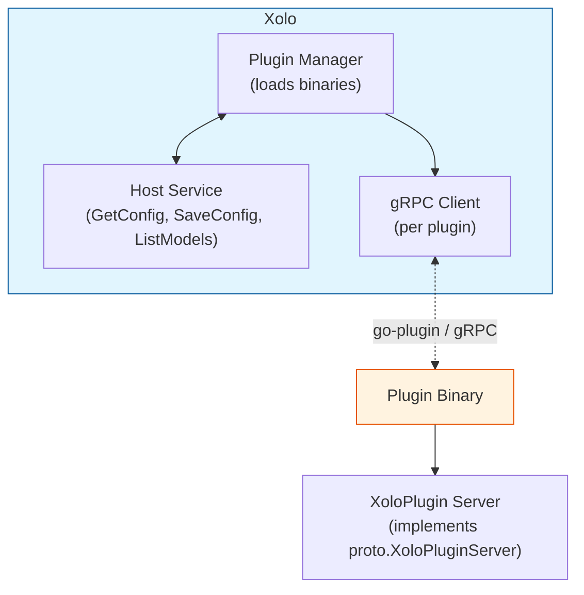

# Building Xolo Plugins in Go

## Overview

Xolo plugins are **external gRPC plugins** that extend the gateway's functionality. They run as separate processes and communicate with Xolo via [hashicorp/go-plugin](https://github.com/hashicorp/go-plugin), enabling:

- **Model resolution** — intercept and redirect requests to different models
- **Request filtering** — allow/deny requests before they reach the LLM proxy
- **Response processing** — modify or log responses after the LLM call
- **Dynamic model listing** — add or filter models in the organization's pool

Plugins are configured per-organization through the admin UI and persist their configuration in Xolo's database.

## Architecture



### Key Components

| Component            | Location                          | Description                                                  |
| -------------------- | --------------------------------- | ------------------------------------------------------------ |
| `PluginDescriptor`   | `proto.PluginDescriptor`          | Plugin metadata (name, version, capabilities, config schema) |
| `XoloPlugin` service | `proto.XoloPluginServer`          | gRPC service implemented by plugins                          |
| `XoloHostService`    | `internal/plugin/host_service.go` | Host-side service for plugins to call back                   |
| Plugin Manager       | `internal/plugin/manager.go`      | Scans, loads, and manages plugin lifecycles                  |
| Plugin SDK           | `pkg/pluginsdk/`                  | Helper libraries for plugin authors                          |

## Plugin Capabilities

Plugins declare which capabilities they support in their `PluginDescriptor`. Xolo invokes the corresponding gRPC method at the appropriate pipeline stage.

### 1. PRE_REQUEST

Invoked **before** the request reaches the LLM proxy. Use cases:

- Rate limiting
- Request validation
- Access control / time-based restrictions
- Request logging or transformation

**Signature:**

```go
func (p *Plugin) PreRequest(ctx context.Context, in *proto.PreRequestInput) (*proto.PreRequestOutput, error)
```

**Input (`PreRequestInput`):**

| Field          | Type              | Description                       |
| -------------- | ----------------- | --------------------------------- |
| `Ctx`          | `*RequestContext` | Organization, user, token, config |
| `Model`        | `string`          | Requested model name              |
| `MessagesJson` | `string`          | JSON-encoded messages array       |

**Output (`PreRequestOutput`):**

| Field                  | Type     | Description                                               |
| ---------------------- | -------- | --------------------------------------------------------- |
| `Allowed`              | `bool`   | Whether to proceed                                        |
| `RejectionReason`      | `string` | Reason shown to user if denied                            |
| `ResponseJson`         | `string` | Optional early response (short-circuits)                  |
| `ModifiedMessagesJson` | `string` | If non-empty, replaces request messages before proxy call |

**Example:** The `time-restriction` plugin denies requests outside configured time windows.

```go
// plugins/time-restriction/plugin.go
func (p *Plugin) PreRequest(_ context.Context, in *proto.PreRequestInput) (*proto.PreRequestOutput, error) {
    cfg, err := parseConfig(in.GetCtx().GetConfigJson())
    if err != nil {
        return &proto.PreRequestOutput{
            Allowed:         false,
            RejectionReason: "Accès refusé : hors des plages horaires autorisées.",
        }, nil
    }
    allowed, _ := isAllowed(time.Now(), cfg)
    if !allowed {
        return &proto.PreRequestOutput{
            Allowed:         false,
            RejectionReason: "Accès refusé : hors des plages horaires autorisées.",
        }, nil
    }
    return &proto.PreRequestOutput{Allowed: true}, nil
}
```

**Example:** Modifying request messages (e.g., adding a system prompt):

```go
func (p *Plugin) PreRequest(ctx context.Context, in *proto.PreRequestInput) (*proto.PreRequestOutput, error) {
    // Parse existing messages
    var messages []map[string]any
    if err := json.Unmarshal([]byte(in.GetMessagesJson()), &messages); err != nil {
        return &proto.PreRequestOutput{Allowed: true}, nil
    }

    // Prepend a system message
    newMessages := []map[string]any{
        {"role": "system", "content": "You are a helpful assistant."},
    }
    newMessages = append(newMessages, messages...)

    // Serialize and return
    modified, _ := json.Marshal(newMessages)
    return &proto.PreRequestOutput{
        Allowed:             true,
        ModifiedMessagesJson: string(modified),
    }, nil
}
```

### 2. POST_RESPONSE

Invoked **after** the LLM proxy responds (or errors). Use cases:

- Response logging or auditing
- Token counting and quota updates
- Metrics recording

**Signature:**

```go
func (p *Plugin) PostResponse(ctx context.Context, in *proto.PostResponseInput) (*proto.PostResponseOutput, error)
```

**Input (`PostResponseInput`):**

| Field              | Type              | Description                       |
| ------------------ | ----------------- | --------------------------------- |
| `Ctx`              | `*RequestContext` | Organization, user, token, config |
| `Model`            | `string`          | Model that was called             |
| `PromptTokens`     | `int64`           | Tokens in the prompt              |
| `CompletionTokens` | `int64`           | Tokens generated                  |
| `HadError`         | `bool`            | Whether the request failed        |

**Output:** Empty struct (currently unused for extensibility).

### 3. RESOLVE_MODEL

Invoked to **resolve a virtual model name** to a real proxy. Use cases:

- Dynamic model routing (selecting the best model for a request)
- Mock/fallback responses for testing
- A/B testing

**Signature:**

```go
func (p *Plugin) ResolveModel(ctx context.Context, in *proto.ResolveModelInput) (*proto.ResolveModelOutput, error)
```

**Input (`ResolveModelInput`):**

| Field             | Type                  | Description                                |
| ----------------- | --------------------- | ------------------------------------------ |
| `Ctx`             | `*RequestContext`     | Organization, user, token, config          |
| `RequestedModel`  | `string`              | Virtual model name (e.g., `"my-org/auto"`) |
| `AvailableModels` | `[]*ModelInfo`        | All real models in the org's pool          |
| `MessagesJson`    | `string`              | JSON-encoded messages                      |
| `VirtualModels`   | `[]*VirtualModelInfo` | Configured virtual models                  |
| `Quota`           | `*QuotaInfo`          | User's quota status                        |
| `BodyJson`        | `string`              | Raw request body JSON                      |

**Output (`ResolveModelOutput`):**

| Field               | Type     | Description                                                  |
| ------------------- | -------- | ------------------------------------------------------------ |
| `ResolvedProxyName` | `string` | Real proxy name to call                                      |
| `ResponseContent`   | `string` | If non-empty, short-circuit with this response (no LLM call) |

**Example:** The `dummy-model` plugin intercepts specific virtual models and returns forged test responses.

```go
// plugins/dummy-model/plugin.go
func (p *Plugin) ResolveModel(ctx context.Context, in *proto.ResolveModelInput) (*proto.ResolveModelOutput, error) {
    cfg, err := ParseConfig(in.GetCtx().GetConfigJson())
    if err != nil {
        return &proto.ResolveModelOutput{}, nil
    }

    // Only handle known virtual models
    if !isVirtualModel(in.GetRequestedModel(), in.GetVirtualModels()) {
        return &proto.ResolveModelOutput{}, nil
    }

    localModel := localModelName(in.GetRequestedModel())
    if !cfg.isTriggerModel(localModel) {
        return &proto.ResolveModelOutput{}, nil
    }

    // Return forged response (bypasses LLM)
    content := fmt.Sprintf("**[dummy-model — réponse de test]**\n\n- **Modèle invoqué** : %s\n", in.GetRequestedModel())
    return &proto.ResolveModelOutput{ResponseContent: content}, nil
}
```

### 4. LIST_MODELS

Invoked to **modify the list of available models** for an organization. Use cases:

- Dynamic model activation based on quota or time
- Feature gating (hide models behind feature flags)

**Signature:**

```go
func (p *Plugin) ListModels(ctx context.Context, in *proto.ListModelsInput) (*proto.ListModelsOutput, error)
```

**Input (`ListModelsInput`):**

| Field             | Type              | Description                       |
| ----------------- | ----------------- | --------------------------------- |
| `Ctx`             | `*RequestContext` | Organization, user, token, config |
| `AvailableModels` | `[]*ModelInfo`    | All configured models             |

**Output (`ListModelsOutput`):**

| Field                  | Type       | Description                  |
| ---------------------- | ---------- | ---------------------------- |
| `AdditionalProxyNames` | `[]string` | Additional proxies to expose |

## Plugin Descriptor & Configuration

Every plugin must implement the `Describe` method, which returns a `PluginDescriptor`:

```go
func (p *Plugin) Describe(_ context.Context, _ *proto.DescribeRequest) (*proto.PluginDescriptor, error) {
    return &proto.PluginDescriptor{
        Name:            "my-plugin",
        Version:         "0.1.0",
        Description:    "A brief description of what this plugin does.",
        Capabilities:   []proto.PluginDescriptor_Capability{
            proto.PluginDescriptor_PRE_REQUEST,
            // Add others as needed
        },
        ConfigSchema:    configSchemaJSON, // JSON Schema for org-level config
    }, nil
}
```

### ConfigSchema

A JSON Schema (draft-07) that drives the admin UI form. The configuration is persisted **per organization** and passed to the plugin in `RequestContext.ConfigJson`.

**Example:** The `time-restriction` plugin defines its configuration schema:

```go
// plugins/time-restriction/config.go
const configSchemaJSON = `{
  "type": "object",
  "required": ["timezone", "slots"],
  "properties": {
    "timezone": {
      "type": "string",
      "title": "Fuseau horaire",
      "description": "Identifiant IANA, ex: Europe/Paris, UTC"
    },
    "slots": {
      "type": "array",
      "title": "Créneaux autorisés",
      "items": {
        "type": "object",
        "required": ["days", "start", "end"],
        "properties": {
          "days": {
            "type": "array",
            "items": {
              "type": "string",
              "enum": ["monday","tuesday","wednesday","thursday","friday","saturday","sunday"]
            }
          },
          "start": { "type": "string", "title": "Heure de début" },
          "end":   { "type": "string", "title": "Heure de fin" }
        }
      }
    }
  }
}`
```

## The Plugin SDK

The plugin SDK (`pkg/pluginsdk/`) provides helpers for serving your plugin and accessing host services.

### Serving Your Plugin

In your plugin's `main.go`:

```go
// Without HTTP UI
func main() {
    pluginsdk.Serve(&Plugin{})
}

// With HTTP UI (optional)
func main() {
    httpHandler := http.HandlerFunc(myUIHandler)
    pluginsdk.ServeWithUI(&Plugin{}, "my-plugin", httpHandler)
}
```

### Accessing Host Services

If your plugin implements `Initialize`, it receives a broker ID to dial the host service:

```go
func (p *Plugin) Initialize(ctx context.Context, req *proto.InitializeRequest) (*proto.InitializeResponse, error) {
    broker := p.broker // set by the SDK wrapper
    conn, err := broker.Dial(req.HostServiceBrokerId)
    if err != nil {
        return nil, err
    }
    hostClient := proto.NewXoloHostServiceClient(conn)
    // Now you can call GetConfig, SaveConfig, ListModels...
}
```

Available host methods:

| Method       | Description                                     |
| ------------ | ----------------------------------------------- |
| `GetConfig`  | Retrieve the org's saved config for this plugin |
| `SaveConfig` | Persist configuration changes                   |
| `ListModels` | Query available models in the organization      |

## Plugin Lifecycle

### 1. Discovery

Xolo scans the **plugin directory** (`--plugins-dir` flag) for executable files. Each file is a separate plugin binary.

### 2. Loading

For each executable:

1. `Manager.loadPlugin()` spawns a subprocess via `go-plugin`
2. Calls `Describe()` to get the plugin descriptor
3. Calls `Initialize()` if implemented (supplies broker ID for host services)
4. Stores the gRPC client and HTTP UI port (if any)

### 3. Execution

At request time, Xolo iterates over loaded plugins and invokes the appropriate capability method. Plugins are called **in order** — the first plugin that returns a non-empty response wins.

### 4. Shutdown

On Xolo shutdown, `Manager.Shutdown()` terminates all plugin subprocesses gracefully.

## Best Practices

### 1. Always return early when not relevant

If your plugin shouldn't handle a request, return the default empty output:

```go
func (p *Plugin) ResolveModel(ctx context.Context, in *proto.ResolveModelInput) (*proto.ResolveModelOutput, error) {
    // Check if this request is relevant
    if !shouldHandle(in.RequestedModel) {
        return &proto.ResolveModelOutput{}, nil  // Pass through
    }
    // ... handle the request
}
```

### 2. Log decisions

Use `slog` for structured logging:

```go
slog.InfoContext(ctx, "plugin-name: selected model",
    slog.String("selected", selected),
    slog.Float64("desired_power_level", desiredPowerLevel),
)
```

### 3. Parse config defensively

Always handle malformed config gracefully:

```go
cfg, err := ParseConfig(in.GetCtx().GetConfigJson())
if err != nil {
    slog.WarnContext(ctx, "my-plugin: failed to parse config, skipping")
    return &proto.PreRequestOutput{Allowed: true}, nil  // Fail open by default
}
```

### 4. Keep config schema minimal

Only expose what's needed in the UI. Complex internal state can be derived or loaded from external sources.

## Example Plugin Structure

```
my-plugin/
├── main.go          # Entry point: pluginsdk.Serve(&Plugin{})
├── plugin.go        # Plugin implementation (Describe, capability methods)
├── config.go        # Config struct + JSON schema + parser
├── scorer.go       # Business logic (optional)
└── ui_handler.go   # HTTP UI handlers (if ServeWithUI)
```

## Summary

| Capability      | When Called  | Use Case                      |
| --------------- | ------------ | ----------------------------- |
| `PRE_REQUEST`   | Before proxy | Access control, rate limiting |
| `POST_RESPONSE` | After proxy  | Logging, quotas               |
| `RESOLVE_MODEL` | Model lookup | Routing, mocking              |
| `LIST_MODELS`   | Model list   | Dynamic model activation      |

Plugins are:

- **Stateless** — configuration comes from Xolo via `ConfigJson`
- **Isolated** — each runs in its own process
- **Composable** — multiple plugins can stack in the pipeline
- **Optional** — Xolo works without any plugins

To build a plugin, implement `proto.XoloPluginServer`, define your `ConfigSchema`, and call `pluginsdk.Serve()` from `main()`.
