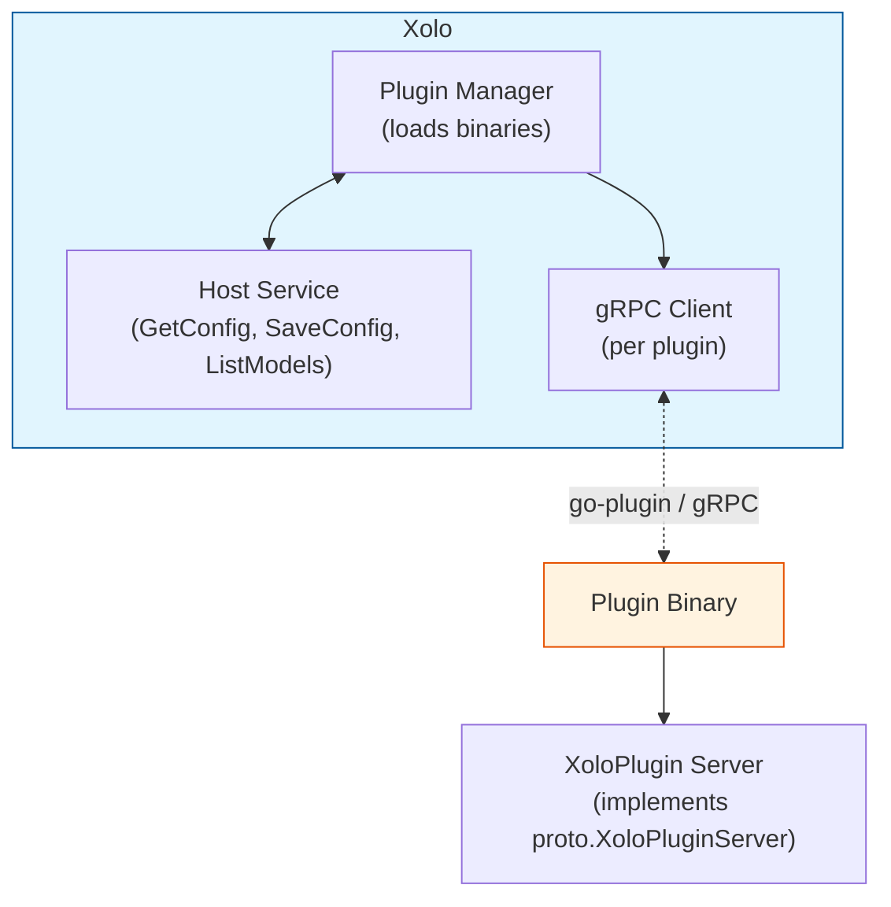

# Building Xolo Plugins in Go

## Overview

Xolo plugins are **external gRPC plugins** that extend the gateway's functionality. They run as separate processes and communicate with Xolo via [hashicorp/go-plugin](https://github.com/hashicorp/go-plugin), enabling:

- **Pre-request processing** — filter, transform, or analyse requests before they reach the LLM proxy
- **Post-response processing** — modify or log responses after the LLM call
- **Model resolution** — intercept and redirect requests to different models
- **Dynamic model listing** — add or filter models in the organization's pool

Plugins are configured per-organization through the admin UI and persist their configuration in Xolo's database.

## Architecture



### Key Components

| Component            | Location                          | Description                                                  |
| -------------------- | --------------------------------- | ------------------------------------------------------------ |
| `PluginDescriptor`   | `proto.PluginDescriptor`          | Plugin metadata (name, version, capabilities, ports, schemas) |
| `XoloPlugin` service | `proto.XoloPluginServer`          | gRPC service implemented by plugins                          |
| `XoloHostService`    | `internal/plugin/host_service.go` | Host-side service for plugins to call back                   |
| Plugin Manager       | `internal/plugin/manager.go`      | Scans, loads, and manages plugin lifecycles                  |
| Plugin SDK           | `pkg/pluginsdk/`                  | Helper libraries for plugin authors                          |

## Plugin Descriptor

Every plugin must implement `Describe`, which declares its identity, capabilities, and pipeline ports:

```go
func (p *Plugin) Describe(_ context.Context, _ *proto.DescribeRequest) (*proto.PluginDescriptor, error) {
    return &proto.PluginDescriptor{
        Name:        "my-plugin",
        Version:     "0.1.0",
        Description: "A brief description of what this plugin does.",
        Capabilities: []proto.PluginDescriptor_Capability{
            proto.PluginDescriptor_PRE_REQUEST,
        },
        InputPorts: []*proto.PortDescriptor{
            {Name: "request", PortType: "request", Required: true},
        },
        OutputPorts: []*proto.PortDescriptor{
            {Name: "score", PortType: "number"},
        },
        ConfigSchema:     configSchemaJSON,     // org-level config (JSON Schema)
        UserConfigSchema: userConfigSchemaJSON, // per-user config (optional)
        DefaultRequired:  false,                // if true, org must configure before activation
    }, nil
}
```

### PluginDescriptor fields

| Field              | Type                   | Description                                              |
| ------------------ | ---------------------- | -------------------------------------------------------- |
| `Name`             | `string`               | Unique plugin identifier (kebab-case)                    |
| `Version`          | `string`               | Semver string                                            |
| `Description`      | `string`               | Short human-readable description                         |
| `Capabilities`     | `[]Capability`         | Which lifecycle hooks the plugin implements              |
| `InputPorts`       | `[]*PortDescriptor`    | Typed data inputs from upstream pipeline nodes           |
| `OutputPorts`      | `[]*PortDescriptor`    | Typed data outputs to downstream pipeline nodes          |
| `ConfigSchema`     | `string`               | JSON Schema for org-level configuration                  |
| `UserConfigSchema` | `string`               | JSON Schema for per-user configuration (optional)        |
| `DefaultRequired`  | `bool`                 | If true, plugin requires explicit org config to activate |

### Port types

Ports have a `port_type` field that controls both the handle shape in the UI and the Go type of the transmitted value:

| Port type  | Go type            | Description                          |
| ---------- | ------------------ | ------------------------------------ |
| `request`  | `string` (JSON)    | Full LLM request body (passthrough)  |
| `response` | `string`           | LLM response content (passthrough)   |
| `number`   | `float64`          | Numeric value                        |
| `string`   | `string`           | Text value                           |
| `boolean`  | `bool`             | Boolean flag                         |

Ports with an empty `OutputPorts` / `InputPorts` list are **dynamic**: the actual ports come from the node's `config_json` at runtime (see `script-processor` for an example).

## Pipeline Integration

Plugins integrate into the **pipeline engine** via their ports. Each plugin node in a pipeline graph:

1. Receives upstream port values in `PreRequestInput.InputsJson` (JSON object `{portName: value}`)
2. Produces downstream port values in `PreRequestOutput.OutputsJson` (JSON object `{portName: value}`)

The pipeline engine topologically sorts nodes and passes outputs from upstream nodes as inputs to downstream nodes. This enables composing plugins into dataflow graphs without code changes — only wiring in the UI.

### node_state: correlating Pre and Post passes

If a plugin needs to correlate its `PreRequest` call with its `PostResponse` call (e.g. storing an anonymisation map), it can return an opaque blob in `PreRequestOutput.NodeState`. The pipeline engine stores this blob and passes it back in `PostResponseInput.NodeState` for the matching execution.

## Plugin Capabilities

### 1. PRE_REQUEST

Invoked **before** the request reaches the LLM proxy. Typical uses: analysis, filtering, routing, message transformation.

**Signature:**

```go
func (p *Plugin) PreRequest(ctx context.Context, in *proto.PreRequestInput) (*proto.PreRequestOutput, error)
```

**Input (`PreRequestInput`):**

| Field          | Type              | Description                                                                  |
| -------------- | ----------------- | ---------------------------------------------------------------------------- |
| `Ctx`          | `*RequestContext` | Organisation, user, token, config                                            |
| `Model`        | `string`          | Full LLM request body JSON (same as `ec.RequestJSON` in the pipeline engine) |
| `MessagesJson` | `string`          | JSON-encoded messages array extracted from the request body                  |
| `InputsJson`   | `string`          | JSON object `{portName: value}` for connected input ports                    |

> **Note:** `Model` does **not** contain just the model name — it contains the entire raw request body as JSON. Use `MessagesJson` for messages, or parse `Model` as JSON to access other fields such as `model`, `temperature`, `max_tokens`, etc.

**Output (`PreRequestOutput`):**

| Field                  | Type     | Description                                                         |
| ---------------------- | -------- | ------------------------------------------------------------------- |
| `Allowed`              | `bool`   | Whether to proceed (`true`) or reject the request (`false`)         |
| `RejectionReason`      | `string` | Reason shown to the user if denied                                  |
| `ResponseJson`         | `string` | Optional early response body (short-circuits without calling LLM)   |
| `ModifiedMessagesJson` | `string` | If non-empty, replaces the request messages before the proxy call   |
| `OutputsJson`          | `string` | JSON object `{portName: value}` of produced output port values      |
| `NodeState`            | `[]byte` | Opaque blob passed back to `PostResponse` for the same execution    |

**Example — access control (time-restriction):**

```go
func (p *Plugin) PreRequest(_ context.Context, in *proto.PreRequestInput) (*proto.PreRequestOutput, error) {
    cfg, err := parseConfig(in.GetCtx().GetConfigJson())
    if err != nil {
        return &proto.PreRequestOutput{Allowed: false, RejectionReason: "config error"}, nil
    }
    allowed, _ := isAllowed(time.Now(), cfg)
    if !allowed {
        return &proto.PreRequestOutput{
            Allowed:         false,
            RejectionReason: "Accès refusé : hors des plages horaires autorisées.",
        }, nil
    }
    return &proto.PreRequestOutput{Allowed: true}, nil
}
```

**Example — producing output port values (request-evaluator):**

```go
func (p *Plugin) PreRequest(_ context.Context, in *proto.PreRequestInput) (*proto.PreRequestOutput, error) {
    vars := scoreRequest(in.MessagesJson, in.Model, in.GetCtx().GetConfigJson())
    outputs := map[string]interface{}{
        "complexity":    vars.Complexity,
        "has_vision":    vars.HasVision,
        "energy_cost":   vars.EnergyCost,
    }
    b, _ := json.Marshal(outputs)
    return &proto.PreRequestOutput{
        Allowed:     true,
        OutputsJson: string(b),
    }, nil
}
```

**Example — modifying messages (prepending a system prompt):**

```go
func (p *Plugin) PreRequest(ctx context.Context, in *proto.PreRequestInput) (*proto.PreRequestOutput, error) {
    var messages []map[string]any
    if err := json.Unmarshal([]byte(in.GetMessagesJson()), &messages); err != nil {
        return &proto.PreRequestOutput{Allowed: true}, nil
    }
    newMessages := append([]map[string]any{
        {"role": "system", "content": "Réponds toujours en français."},
    }, messages...)
    modified, _ := json.Marshal(newMessages)
    return &proto.PreRequestOutput{
        Allowed:              true,
        ModifiedMessagesJson: string(modified),
    }, nil
}
```

**Example — passthrough port forwarding (forward all inputs to outputs):**

```go
func (p *Plugin) PreRequest(_ context.Context, in *proto.PreRequestInput) (*proto.PreRequestOutput, error) {
    return &proto.PreRequestOutput{
        Allowed:     true,
        OutputsJson: in.InputsJson, // forward all inputs as outputs
    }, nil
}
```

### 2. POST_RESPONSE

Invoked **after** the LLM proxy responds (or errors). Typical uses: logging, quota tracking, response transformation (e.g. de-pseudonymisation).

**Signature:**

```go
func (p *Plugin) PostResponse(ctx context.Context, in *proto.PostResponseInput) (*proto.PostResponseOutput, error)
```

**Input (`PostResponseInput`):**

| Field               | Type              | Description                                                        |
| ------------------- | ----------------- | ------------------------------------------------------------------ |
| `Ctx`               | `*RequestContext` | Organisation, user, token, config                                  |
| `Model`             | `string`          | Model that was called                                              |
| `PromptTokens`      | `int64`           | Tokens in the prompt                                               |
| `CompletionTokens`  | `int64`           | Tokens generated                                                   |
| `HadError`          | `bool`            | Whether the LLM call failed                                        |
| `ResponseContent`   | `string`          | Full LLM response text                                             |
| `NodeState`         | `[]byte`          | Opaque blob returned by `PreRequest` for the same pipeline execution |

**Output (`PostResponseOutput`):**

| Field                     | Type     | Description                                                                     |
| ------------------------- | -------- | ------------------------------------------------------------------------------- |
| `ModifiedResponseContent` | `string` | If non-empty, replaces the response sent to the client (e.g. de-anonymisation)  |

**Example — response transformation using node_state:**

```go
func (p *Plugin) PreRequest(_ context.Context, in *proto.PreRequestInput) (*proto.PreRequestOutput, error) {
    mapping := buildPseudonymMap(in.GetMessagesJson())
    state, _ := json.Marshal(mapping)
    return &proto.PreRequestOutput{
        Allowed:   true,
        NodeState: state,
    }, nil
}

func (p *Plugin) PostResponse(_ context.Context, in *proto.PostResponseInput) (*proto.PostResponseOutput, error) {
    var mapping map[string]string
    if err := json.Unmarshal(in.NodeState, &mapping); err != nil {
        return &proto.PostResponseOutput{}, nil
    }
    restored := applyReverseMapping(in.ResponseContent, mapping)
    return &proto.PostResponseOutput{ModifiedResponseContent: restored}, nil
}
```

### 3. RESOLVE_MODEL

Invoked to **resolve a virtual model name** to a real proxy name. Typical uses: mock/fallback responses, A/B testing.

> **Note:** Model routing is now best implemented with a `script-processor` node in a pipeline graph rather than `RESOLVE_MODEL`. `RESOLVE_MODEL` is kept for legacy compatibility and edge cases such as fully synthetic responses.

**Signature:**

```go
func (p *Plugin) ResolveModel(ctx context.Context, in *proto.ResolveModelInput) (*proto.ResolveModelOutput, error)
```

**Input (`ResolveModelInput`):**

| Field             | Type                  | Description                                |
| ----------------- | --------------------- | ------------------------------------------ |
| `Ctx`             | `*RequestContext`     | Organisation, user, token, config          |
| `RequestedModel`  | `string`              | Virtual model name (e.g. `"my-org/auto"`)  |
| `AvailableModels` | `[]*ModelInfo`        | All real models in the org's pool          |
| `MessagesJson`    | `string`              | JSON-encoded messages                      |
| `VirtualModels`   | `[]*VirtualModelInfo` | Configured virtual models                  |
| `Quota`           | `*QuotaInfo`          | User's quota status                        |
| `BodyJson`        | `string`              | Raw request body JSON                      |

**Output (`ResolveModelOutput`):**

| Field               | Type     | Description                                                                  |
| ------------------- | -------- | ---------------------------------------------------------------------------- |
| `ResolvedProxyName` | `string` | Real proxy name to call                                                      |
| `ResponseContent`   | `string` | If non-empty, short-circuit the request and return this text (no LLM call)   |

**Example — dummy model returning a synthetic response:**

```go
func (p *Plugin) ResolveModel(ctx context.Context, in *proto.ResolveModelInput) (*proto.ResolveModelOutput, error) {
    cfg, err := ParseConfig(in.GetCtx().GetConfigJson())
    if err != nil {
        return &proto.ResolveModelOutput{}, nil
    }
    localModel := localModelName(in.GetRequestedModel())
    if !cfg.isTriggerModel(localModel) {
        return &proto.ResolveModelOutput{}, nil // pass through
    }
    content := fmt.Sprintf("**[dummy-model]**\n\n- Modèle invoqué : %s\n", in.GetRequestedModel())
    return &proto.ResolveModelOutput{ResponseContent: content}, nil
}
```

### 4. LIST_MODELS

Invoked to **modify the list of available models** for an organization.

**Signature:**

```go
func (p *Plugin) ListModels(ctx context.Context, in *proto.ListModelsInput) (*proto.ListModelsOutput, error)
```

**Input (`ListModelsInput`):**

| Field             | Type              | Description                       |
| ----------------- | ----------------- | --------------------------------- |
| `Ctx`             | `*RequestContext` | Organisation, user, token, config |
| `AvailableModels` | `[]*ModelInfo`    | All configured models             |

**Output (`ListModelsOutput`):**

| Field                  | Type       | Description                  |
| ---------------------- | ---------- | ---------------------------- |
| `AdditionalProxyNames` | `[]string` | Additional proxies to expose |

## RequestContext

The `RequestContext` struct is passed to every capability method:

| Field            | Type     | Description                              |
| ---------------- | -------- | ---------------------------------------- |
| `OrgId`          | `string` | Organisation ID                          |
| `UserId`         | `string` | User ID                                  |
| `TokenId`        | `string` | API token ID used for the request        |
| `DisplayName`    | `string` | User display name                        |
| `ConfigJson`     | `string` | Org-level plugin configuration (JSON)    |
| `UserConfigJson` | `string` | Per-user plugin configuration (optional) |

## ModelInfo

Available models are described by `ModelInfo`:

| Field                       | Type     | Description                     |
| --------------------------- | -------- | ------------------------------- |
| `ProxyName`                 | `string` | Name used in API requests       |
| `RealModel`                 | `string` | Underlying provider model name  |
| `ProviderId`                | `string` | Provider identifier             |
| `ContextLength`             | `int64`  | Maximum context window (tokens) |
| `SupportsVision`            | `bool`   | Accepts image inputs            |
| `SupportsReasoning`         | `bool`   | Extended reasoning capability   |
| `SupportsEmbeddings`        | `bool`   | Produces embedding vectors      |
| `ActiveParamsBillions`      | `float32`| Active parameters in billions   |

## Configuration Schemas

Each plugin can declare two JSON Schema (draft-07) schemas:

- **`ConfigSchema`** — org-level config, persisted per organisation. Passed in `ctx.config_json`.
- **`UserConfigSchema`** — per-user config (optional). Passed in `ctx.user_config_json`.

Both schemas drive form generation in the admin UI.

**Example:**

```go
const configSchemaJSON = `{
  "type": "object",
  "required": ["timezone"],
  "properties": {
    "timezone": {
      "type": "string",
      "title": "Fuseau horaire",
      "description": "Identifiant IANA, ex: Europe/Paris, UTC"
    }
  }
}`
```

## The Plugin SDK

### Serving Your Plugin

```go
// Without HTTP UI
func main() {
    pluginsdk.Serve(&Plugin{})
}

// With HTTP UI (config editor, analytics…)
func main() {
    pluginsdk.ServeWithUI(&Plugin{}, "my-plugin", newUIHandler())
}
```

### Accessing Host Services

Implement `Initialize` to receive the host service broker:

```go
func (p *Plugin) Initialize(ctx context.Context, req *proto.InitializeRequest) (*proto.InitializeResponse, error) {
    conn, err := p.broker.Dial(req.HostServiceBrokerId)
    if err != nil {
        return nil, err
    }
    p.host = proto.NewXoloHostServiceClient(conn)
    return &proto.InitializeResponse{}, nil
}
```

Available host methods:

| Method         | Description                                          |
| -------------- | ---------------------------------------------------- |
| `GetConfig`    | Retrieve the org's saved config for this plugin      |
| `SaveConfig`   | Persist configuration changes                        |
| `ListModels`   | Query available models in the organisation           |
| `GetSecret`    | Read a per-node encrypted secret                     |
| `SetSecret`    | Store a per-node encrypted secret                    |
| `DeleteSecret` | Remove a per-node encrypted secret                   |
| `EmitEvent`    | Record an event in Xolo's event system (see below)   |

## Emitting Events

Plugins can push events into Xolo's [event system](./eventql-syntax.md) so their
activity shows up in the events explorer and can trigger alerts — for example a
_sensitive-data detected_ event from `pseudonymizer`, or a _request blocked_
event from `time-restriction`.

### Getting a HostClient

The SDK exposes a friendly `pluginsdk.HostClient` interface (rather than the raw
gRPC client). To receive one inside your plugin's gRPC methods (e.g.
`PreRequest`), implement `pluginsdk.HostClientSetter`; the runtime calls
`SetHostClient` once, during `Initialize`, after the broker connection to the
host service is established:

```go
type Plugin struct {
    proto.UnimplementedXoloPluginServer

    hostMu     sync.Mutex
    hostClient pluginsdk.HostClient
}

// SetHostClient implements pluginsdk.HostClientSetter.
func (p *Plugin) SetHostClient(c pluginsdk.HostClient) {
    p.hostMu.Lock()
    defer p.hostMu.Unlock()
    p.hostClient = c
}

func (p *Plugin) getHostClient() pluginsdk.HostClient {
    p.hostMu.Lock()
    defer p.hostMu.Unlock()
    return p.hostClient
}
```

> This works out of the box with `ServeWithUI`. The same `HostClient` is also
> injected into the HTTP UI request context, retrievable with
> `pluginsdk.HostClientFromContext(ctx)`.

### Emitting an event

```go
func (p *Plugin) emitEvent(evt pluginsdk.Event) {
    hc := p.getHostClient()
    if hc == nil {
        return // host not connected (e.g. running standalone in tests)
    }
    // Emit off the request path: a synchronous gRPC round-trip must never slow
    // down request processing.
    go func() {
        ctx, cancel := context.WithTimeout(context.Background(), 5*time.Second)
        defer cancel()
        if err := hc.EmitEvent(ctx, evt); err != nil {
            slog.Warn("could not emit event", slog.Any("error", err))
        }
    }()
}

func (p *Plugin) PreRequest(ctx context.Context, in *proto.PreRequestInput) (*proto.PreRequestOutput, error) {
    // …when something noteworthy happens:
    p.emitEvent(pluginsdk.Event{
        PluginName: "my-plugin",
        OrgID:      in.GetCtx().GetOrgId(),  // may be empty for platform-global events
        UserID:     in.GetCtx().GetUserId(), // may be empty when not tied to a user
        Type:       "something.happened",
        Severity:   "warning",              // "info" (default) | "warning" | "error"
        Message:    "Human-readable summary",
        Attributes: map[string]string{
            "count": "3",
            "kind":  "example",
        },
    })
    return &proto.PreRequestOutput{Allowed: true}, nil
}
```

### `pluginsdk.Event` fields

| Field        | Description                                                                    |
| ------------ | ------------------------------------------------------------------------------ |
| `PluginName` | Your plugin's name. Used to derive the event source and type namespace.        |
| `OrgID`      | Organisation the event belongs to; empty = platform-global event.              |
| `UserID`     | User the event concerns; empty = not tied to a user.                           |
| `Type`       | Short dotted type, e.g. `sensitive-data.detected`.                             |
| `Severity`   | `info` (default), `warning`, or `error`.                                       |
| `Message`    | Human-readable message (queryable with line filters `\|=`, `\|~`).             |
| `Attributes` | Free key/value pairs, queryable with attribute filters (`\| key="value"`).     |

### Source and type namespacing

The host is authoritative and rewrites two fields so a plugin can never
impersonate a platform event:

- The event **source** is forced to your plugin name (`PluginName`).
- The **type** is namespaced under `plugin.<PluginName>.`. Emitting
  `sensitive-data.detected` from `pseudonymizer` is stored as
  `plugin.pseudonymizer.sensitive-data.detected`.

Query them from the events explorer with [eventql](./eventql-syntax.md):

```
{source="pseudonymizer"}
{type="plugin.time-restriction.request.blocked"}
{type=~"plugin\\..*"}          # every plugin-emitted event
```

Or alert on them, e.g. `count(1h) > 0` over
`{type="plugin.pseudonymizer.sensitive-data.detected"}`.

> **Testing.** `getHostClient` returns `nil` when no host is connected, so
> `emitEvent` becomes a no-op — plugins remain runnable in unit tests without a
> host. Fakes can implement `HostClient` (including a no-op `EmitEvent`).

## Built-in Plugins

| Plugin              | Capabilities              | Description                                                       |
| ------------------- | ------------------------- | ----------------------------------------------------------------- |
| `time-restriction`  | PRE_REQUEST               | Denies requests outside configured time windows                   |
| `request-evaluator` | PRE_REQUEST               | Scores a request (complexity, vision, reasoning, energy) for routing |
| `fuzzy-evaluator`   | PRE_REQUEST               | Fuzzy logic inference on numeric port values                      |
| `script-processor`  | PRE_REQUEST               | Executes a Tengo script with arbitrary input/output ports          |
| `dummy-model`       | RESOLVE_MODEL             | Returns synthetic responses for designated virtual models         |

### script-processor

The `script-processor` plugin executes a [Tengo](https://github.com/d5/tengo) script. Its input and output ports are fully configurable — no code changes required, only config.

**Script contract:** the script must export a function `func(ctx)` that returns a map:

```tengo
export func(ctx) {
    // ctx.request — full LLM request body (parsed JSON map)
    // ctx.inputs  — connected input port values by name

    model := ctx.inputs["model_leger"]
    if ctx.inputs["power_level"] > 0.75 {
        model = ctx.inputs["model_puissant"]
    }

    return {
        outputs: { model_name: model },   // values for output ports
        messages: ctx.request["messages"] // optional: replace messages
    }
}
```

**Config JSON:**

```json
{
  "script": "export func(ctx) { ... }",
  "inputs": [
    {"name": "power_level", "portType": "number"},
    {"name": "model_leger",  "portType": "string"}
  ],
  "outputs": [
    {"name": "model_name", "portType": "string"}
  ]
}
```

`messages` in the return map is **reserved** — it replaces the LLM messages. It cannot be used as an output port name.

Available Tengo stdlib modules: `json`, `math`, `text`, `rand`, `times`. Max allocations: 1 MiB.

## Plugin Lifecycle

1. **Discovery** — Xolo scans the plugin directory (`--plugins-dir`) for executables.
2. **Loading** — each binary is spawned via `go-plugin`; `Describe()` and `Initialize()` are called.
3. **Execution** — at request time, the pipeline engine calls the appropriate capability method.
4. **Shutdown** — `Manager.Shutdown()` terminates all plugin subprocesses.

## Plugin File Structure

```
my-plugin/
├── main.go          # pluginsdk.Serve(&Plugin{}) or ServeWithUI
├── plugin.go        # Describe + capability methods
├── config.go        # Config struct, JSON schema, parser
└── ui_handler.go    # HTTP UI handlers (if using ServeWithUI)
```

## Best Practices

**Return early when not relevant:**

```go
func (p *Plugin) ResolveModel(ctx context.Context, in *proto.ResolveModelInput) (*proto.ResolveModelOutput, error) {
    if !shouldHandle(in.RequestedModel) {
        return &proto.ResolveModelOutput{}, nil
    }
    // ...
}
```

**Parse config defensively:**

```go
cfg, err := ParseConfig(in.GetCtx().GetConfigJson())
if err != nil {
    slog.WarnContext(ctx, "my-plugin: bad config, skipping")
    return &proto.PreRequestOutput{Allowed: true}, nil // fail open
}
```

**Use structured logging:**

```go
slog.InfoContext(ctx, "my-plugin: selected model",
    slog.String("model", selected),
    slog.Float64("power_level", powerLevel),
)
```

**Never block the request on non-critical errors** — always return `Allowed: true` and log the problem rather than denying access due to a monitoring failure.

## Capability Summary

| Capability      | When Called  | Primary Use Cases                         |
| --------------- | ------------ | ----------------------------------------- |
| `PRE_REQUEST`   | Before proxy | Filtering, analysis, routing, message mod |
| `POST_RESPONSE` | After proxy  | Logging, quotas, response transformation  |
| `RESOLVE_MODEL` | Model lookup | Synthetic responses, legacy routing       |
| `LIST_MODELS`   | Model list   | Dynamic model activation                  |

Plugins are **stateless** (configuration comes via `ConfigJson`), **isolated** (each runs in its own process), **composable** (multiple plugins stack in the pipeline graph), and **optional** (Xolo works without any).
