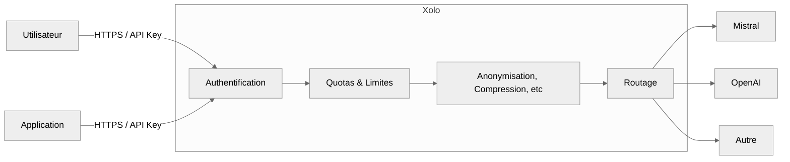
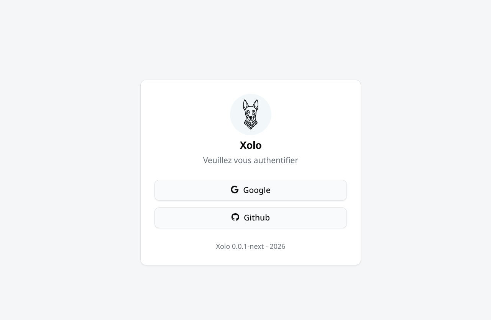
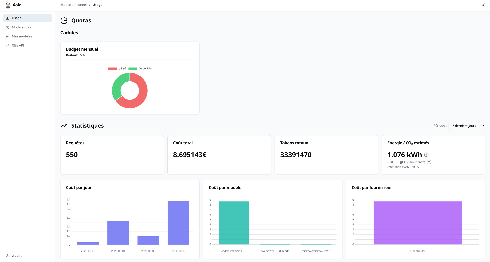
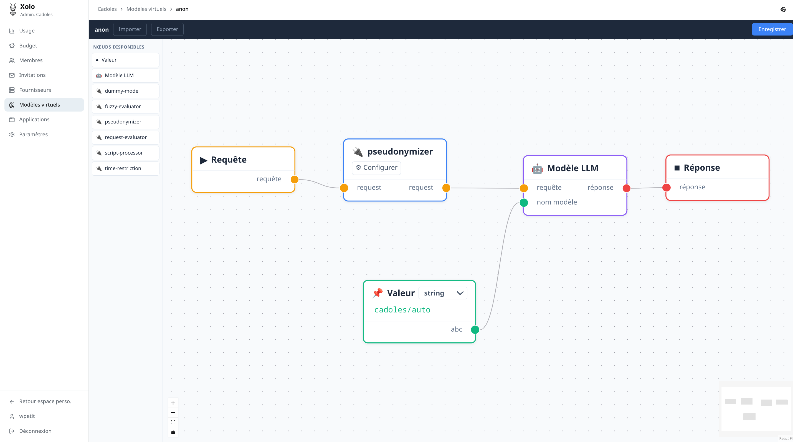

## L'essentiel

> L'IA générative est déjà dans votre organisation, qu'elle soit autorisée ou non. Xolo vous donne le **point de contrôle technique** qui manque aujourd'hui à votre SI : une passerelle unique, auto-hébergée, qui centralise les accès, trace les usages, plafonne les coûts, anonymise les données sensibles et préserve votre **liberté de choix technologique**. Déploiement en quelques minutes, exploitation maîtrisée, données chez vous.

## Le problème que vous avez déjà

L'adoption de l'IA générative s'est faite **par les usages, avant la gouvernance**. Vos équipes utilisent ChatGPT, Claude, Mistral ou Copilot: parfois en shadow IT, parfois avec des comptes pro mal cadrés. Pour une DSI, cela se traduit par :

- **Sécurité**: données métier envoyées en clair à des tiers, sans journalisation.
- **Coûts**: abonnements multipliés, clés API non centralisées, facturation opaque.
- **Conformité**: RGPD, secret des affaires, obligations sectorielles difficiles à démontrer.
- **Verrouillage**: dépendance croissante à un fournisseur unique, sans plan de réversibilité.
- **Pilotage**: aucune visibilité sur qui utilise quoi, à quel coût, pour quel ROI.

> **Le vrai sujet n'est pas "faut-il faire de l'IA ?"**: c'est _"comment l'industrialiser sans perdre le contrôle ?"_

## La réponse Xolo

Une **passerelle LLM (gateway)** qui s'intercale entre vos utilisateurs/applications et les modèles de langage. Compatible avec l'**API OpenAI**: donc immédiatement utilisable par la plupart des outils du marché et de vos développements internes.



## Vue d'ensemble fonctionnelle

| Domaine          | Capacité Xolo                               | Bénéfice DSI                                |
| ---------------- | ------------------------------------------- | ------------------------------------------- |
| **Identité**     | OpenID Connect + clés API                   | Zéro compte à gérer, alignement IAM         |
| **Multi-tenant** | Organisations cloisonnées                   | Une plateforme pour N entités               |
| **Fournisseurs** | Multi-fournisseurs natif                    | Liberté, réversibilité, mise en concurrence |
| **Pilotage**     | Quotas + suivi d'usage                      | Maîtrise budgétaire et FinOps IA            |
| **Exploitation** | SQLite embarqué ou PostgreSQL, auto-hébergé | Déploiement et MCO simplifiés               |
| **Sécurité**     | Plugins, pseudonymisation                   | Réduction du risque de fuite de données     |

---

## Intégration au SI existant

**Authentification fédérée (OIDC)**

Xolo se branche sur votre fournisseur d'identité existant: **Google, Github, Gitlab, Keycloak, Azure, Okta, etc.**

- Vos collaborateurs s'authentifient avec leurs identifiants d'entreprise.
- Aucun annuaire parallèle, aucune dispersion des accès.
- Les politiques de sécurité (MFA, conditional access, durée de session) s'appliquent nativement.

**Accès applicatif**

- Clés API pour les **intégrations machine-to-machine** (outils internes, scripts, agents).
- Compatibilité **API OpenAI** : la plupart des SDK et outils (LangChain, LlamaIndex, librairies officielles…) fonctionnent sans modification.

:attrs{class="img large", data-label="Authentification standardisée et multi-fournisseurs d'identité"}



---

## Architecture multi-organisation

Pensée pour les **structures complexes**:

| Cas d'usage                | Apport de Xolo                                |
| -------------------------- | --------------------------------------------- |
| Groupe avec filiales       | Une plateforme, N organisations cloisonnées   |
| ESN avec plusieurs clients | Étanchéité contractuelle native               |
| Collectivité mutualisée    | Mutualisation infra, indépendance des entités |
| Direction transverse       | Cloisonnement par direction métier            |

Chaque organisation dispose de **ses propres** : membres, rôles (propriétaire / administrateur / membre), invitations, fournisseurs, modèles, quotas, historiques.

> **Conséquence opérationnelle**: un seul socle à exploiter, mais une gouvernance différenciée par entité.

---

## Liberté de choix technologique

Aucun verrouillage fournisseur. Chaque organisation peut connecter **plusieurs fournisseurs LLM** en parallèle.

**Types de fournisseurs connectables**

- **Internationaux**: OpenAI, Anthropic, Google, etc.
- **Européens / souverains**: Mistral, OVHcloud AI Endpoints, Scaleway, etc.
- **Internes**: vLLM, Ollama, instances on-premise.
- **Mixtes**: combinaison selon sensibilité de la donnée ou criticité de l'usage.

**Pilotage par fournisseur**

| Paramètre                       | Configuration      |
| ------------------------------- | ------------------ |
| Clés d'accès                    | Chiffrées au repos |
| Limitation de débit             | Par fournisseur    |
| Règles de relance               | Configurables      |
| Coûts (prompt/complétion/cache) | Définis par modèle |

> **Conséquence stratégique** : vous pouvez **mettre les fournisseurs en concurrence**, **basculer en cas d'incident**, ou **router selon la criticité** (données sensibles → modèle interne ; usages génériques → cloud).

---

## Pilotage budgétaire et FinOps IA

L'un des angles morts des déploiements IA actuels : **personne ne sait combien ça coûte vraiment, ni pour quoi**.

**Quotas configurables**

- Par organisation et par utilisateur.
- Sur des périodes **journalière, mensuelle, annuelle**.
- Avec alertes et blocage au seuil.

**Suivi d'usage détaillé**

| Dimension   | Granularité               |
| ----------- | ------------------------- |
| Utilisateur | Consommation individuelle |
| Application | Par clé API / par outil   |
| Fournisseur | Répartition multi-acteurs |
| Modèle      | Coût par modèle utilisé   |
| Période     | Historique horodaté       |

- **Coûts figés au moment de l'appel** : pas de mauvaise surprise rétroactive.
- **Export des données** pour intégration dans vos outils BI / FinOps.

:attrs{class="img medium", data-label="Tableau de bord de suivi des coûts et usages"}



## Souveraineté et exploitation

**Auto-hébergement sans complexité**

- Repose sur **SQLite embarqué** ou **PostgreSQL**: s'adapte à toutes les topologies.
- **Déploiement en quelques minutes** sur votre infrastructure.
- **Pas de coût de licence** additionnel.
- Compatible avec vos pratiques DevOps existantes (conteneurs, reverse proxy, supervision).

**Données chez vous, sous votre contrôle**

| Donnée              | Localisation         |
| ------------------- | -------------------- |
| Conversations       | Votre infrastructure |
| Identités           | Votre IdP            |
| Clés fournisseurs   | Chiffrées, chez vous |
| Historiques d'usage | Votre infrastructure |

> **Conséquence conformité** : la démonstration de maîtrise de la donnée auprès du DPO, du RSSI ou d'un auditeur devient **simple et factuelle**.

---

## Plugins, modèles virtuels et anonymisation

Xolo ne se limite pas au relais: c'est une **plateforme extensible**.

**Architecture des plugins**

- Exécution en **sous-processus isolés** (pas de risque de compromission du cœur).
- **Rechargement automatique** en cas d'incident.
- **Bornage mémoire** pour la stabilité en production.

**Modèles virtuels**

Des **alias métier** qui combinent un modèle réel avec une chaîne de traitements personnalisée :

```
mon-organisation/assistant-juridique
mon-organisation/support-niveau-1
mon-organisation/analyse-rh-anonymisee
```

Chaque modèle virtuel peut intégrer :

| Composant             | Exemple                             |
| --------------------- | ----------------------------------- |
| Modèle réel           | GPT-4, Mistral Large, Llama interne |
| Limites de jetons     | Plafond par requête                 |
| Répartition de charge | Bascule entre fournisseurs          |
| Filtres               | Liste de termes interdits           |
| Transformations       | Pré/post-traitement, anonymisation  |

> **Conséquence métier** : vous exposez à vos utilisateurs des **services IA contextualisés et sécurisés**, pas des modèles bruts.

---

### Focus: pseudonymisation automatique

1. **Détection** des données à caractère personnel dans la requête (noms, identifiants, adresses, etc.).
2. **Substitution** par des valeurs anonymisées **cohérentes** (un même nom → un même pseudonyme dans toute la requête).
3. **Envoi au fournisseur** de la version anonymisée.
4. **Restitution en clair** dans la réponse finale à l'utilisateur.

> **Bénéfice DSI / RSSI / DPO** : un levier technique concret pour **concilier innovation IA et conformité RGPD**, sans dépendre de la vigilance individuelle des utilisateurs.

:attrs{class="img large", data-label="Modèle virtuel avec pipeline de traitement"}



---

## Cas d'usage prioritaires

| Persona / Direction      | Usage typique                               | Apport Xolo                      |
| ------------------------ | ------------------------------------------- | -------------------------------- |
| **DSI**                  | Cadrage de l'usage IA dans le SI            | Point de contrôle unique         |
| **RSSI**                 | Réduction du risque de fuite de données     | Anonymisation + auto-hébergement |
| **DPO**                  | Démonstration de conformité RGPD            | Traçabilité + pseudonymisation   |
| **Direction Financière** | Maîtrise des coûts IA                       | Quotas + suivi détaillé          |
| **Direction Métier**     | Mise à disposition d'assistants spécialisés | Modèles virtuels                 |
| **Direction Innovation** | Test multi-fournisseurs                     | Multi-fournisseurs natif         |

## Ce que vous gagnez, en synthèse

| Enjeu DSI         | Avant Xolo                      | Avec Xolo                            |
| ----------------- | ------------------------------- | ------------------------------------ |
| **Visibilité**    | Shadow IT, comptes dispersés    | Point de contrôle unique             |
| **Sécurité**      | Données envoyées en clair       | Anonymisation automatique            |
| **Coûts**         | Abonnements multipliés, opaques | Quotas + FinOps IA                   |
| **Conformité**    | Démonstration difficile         | Traçabilité native                   |
| **Réversibilité** | Verrou fournisseur              | Multi-fournisseurs                   |
| **Exploitation**  | Outils hétérogènes              | Socle unique, auto-hébergé ou managé |
| **Souveraineté**  | Données chez des tiers          | Données chez vous                    |

<style>
  .img {
    display: block;
    width: 100%;
    text-align: center;
  }
  .img.small > img {
    width: 33%;
  }
  .img.medium  > img {
    width: 66%;
  }
  .img.large  > img {
    width: 100%;
  }
  .img::after {
    content: attr(data-label);
    text-align: center;
    display: block;
    font-style: italic;
    margin-top: -5px;
  }
</style>
